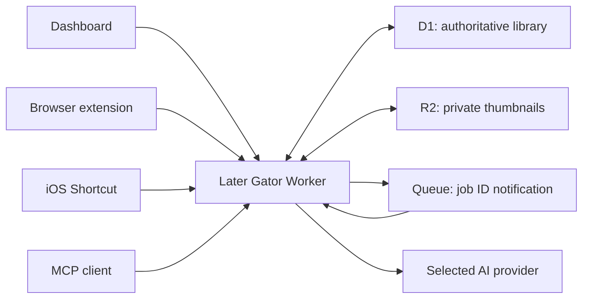
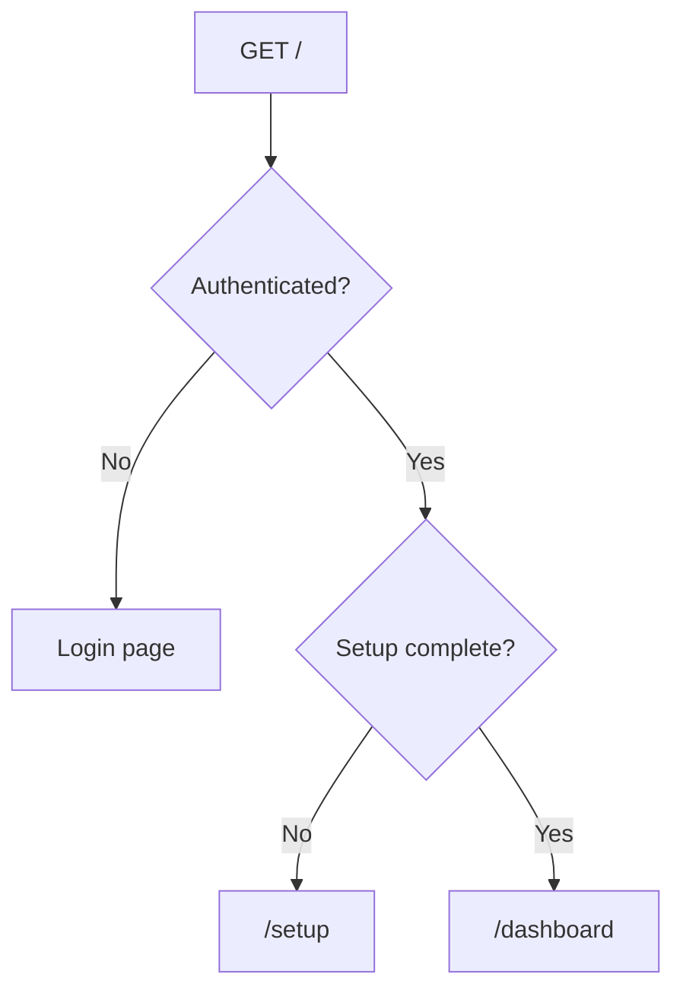
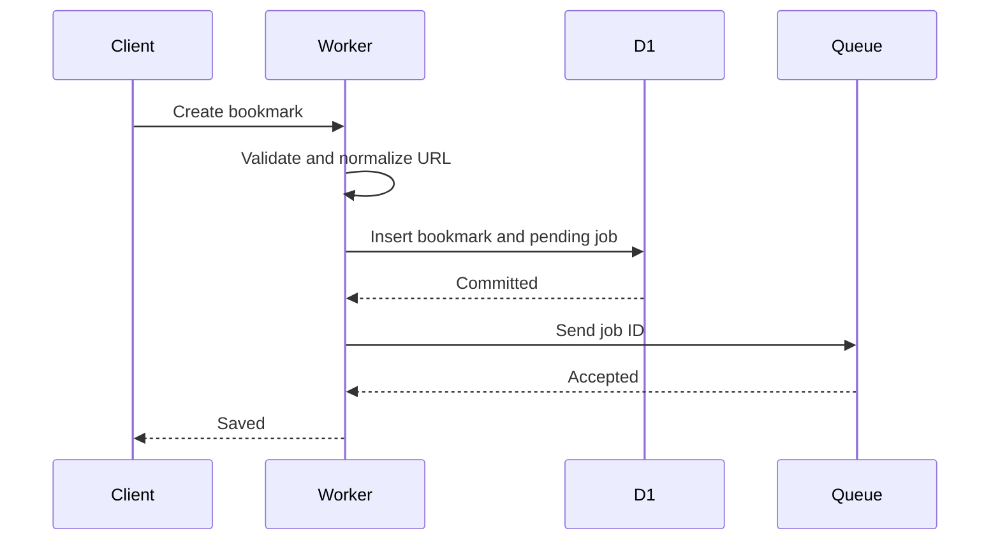

# Later Gator v2 Developer Guide

**Applies to:** the v6 target architecture

**Companion documents:** PRD v6.0 and Technical Design v2.0

**Current repository status:** `src/index.ts` now selects the v6 implementation
under `src/v6`. The older source tree is retained temporarily as migration
history but is excluded from the active TypeScript, lint, test, and deployment
entry points.

---

## 1. The mental model

Later Gator v2 is the bookmark manager.



The most important rules are:

1. D1 is the system of record.
2. R2 contains only thumbnail binaries.
3. Queue messages contain only a job ID.
4. AI never writes without rechecking the bookmark revision.
5. Raindrop is only a CSV import source.
6. View and edit remain usable when AI is unavailable.

If you remember those six rules, most of the design follows naturally.

---

## 2. What changed from v1.5

The previous implementation was built around Raindrop:

- Cron searches Raindrop Unsorted.
- Queue messages refer to Raindrop bookmarks.
- KV contains onboarding, leases, folder IDs, and a tag registry.
- Raindrop remains authoritative.

The v2 implementation replaces that architecture:

| Old concept                  | v2 replacement                                   |
| ---------------------------- | ------------------------------------------------ |
| Raindrop bookmark            | D1 `bookmarks` row                               |
| Raindrop folder IDs          | Seeded immutable D1 `folders` rows               |
| Raindrop tag registry        | D1 `tags` and `bookmark_tags`                    |
| Registry resynchronization   | Not needed                                       |
| 15-minute discovery Cron     | Immediate job creation when a bookmark is stored |
| Dispatch lease               | Not needed                                       |
| Lease revision               | Bookmark revision and job state                  |
| Raindrop rate-limit deferral | Provider-specific waiting state only             |
| KV operational documents     | Relational D1 state                              |
| Raindrop search through MCP  | D1/FTS search                                    |
| Raindrop onboarding reset    | Personal setup plus optional CSV import          |

The verified v2 entry point is active. Remove remaining legacy files only as a
separate housekeeping change after confirming no release tooling references
them.

---

## 3. Authoritative state

### D1

D1 owns:

- Bookmarks.
- Tags and bookmark-tag associations.
- Fixed folders.
- Related-bookmark relationships.
- Favorite and Trash state.
- Setup and personalization.
- AI jobs and provider/model configuration.
- Import preview and progress.
- Sessions.
- Encrypted provider settings.
- Capture and MCP credential hashes.
- Thumbnail metadata.

### R2

R2 owns:

- One normalized thumbnail object per bookmark when available.

It does not own:

- Bookmark text.
- Provider credentials.
- Import files.
- Public image URLs.

### Queue

The Queue owns no durable application truth. It carries:

```json
{
  "version": 1,
  "jobId": "..."
}
```

If a message is duplicated, delayed, or retried, the consumer asks D1 whether the job is still eligible.

### AI provider

The provider supplies a proposal and usage metadata. It never becomes authoritative. Application code validates and applies the proposal.

---

## 4. Request entry points

There are four authorization lanes.

### Dashboard lane

- Secure HTTP-only session cookie.
- Same-origin validation.
- CSRF token on mutations.
- Full single-user administration privileges.

### Browser-extension lane

- Scoped bearer token.
- Can fetch fixed folders and tag suggestions.
- Can create a bookmark, linked bookmark, and relationship.
- Can inspect only the result of its own request.

### iOS Shortcut lane

- Separate minimal bearer token.
- Can create one URL in Unsorted.
- Cannot send tags, notes, folders, favorite, or Linked to.

### MCP lane

- Separate opaque path credential.
- Read-only tools.
- Cannot mutate the library or control AI.

Never let credentials cross lanes. In particular:

- The extension and Shortcut do not receive the Later Gator password.
- MCP does not receive a dashboard session.
- A dashboard cookie does not authorize capture routes.
- A capture bearer cannot call MCP.

---

## 5. Deployment and first login

The user presses **Deploy to Cloudflare** and enters one blank secret labelled **Later Gator password**.

Cloudflare provisions:

- Worker and static assets.
- D1.
- R2.
- Queue.
- Workers AI.

The user opens the root URL.



The user never needs to append `/setup`.

### Password initialization

The deployment password is a bootstrap input. On first valid login, the application:

1. Generates a random data-encryption key.
2. Derives a wrapping key from the password.
3. Encrypts the data-encryption key.
4. Stores the wrapped key and KDF parameters in D1.

Provider keys are encrypted with the data-encryption key.

Changing the password rewraps the same data-encryption key and revokes sessions. It does not have to decrypt and rewrite every provider credential.

There is no application-side forgotten-password recovery that can decrypt provider keys. The user must protect the Later Gator password and keep a library export.

---

## 6. Setup

Setup is product personalization, not Raindrop onboarding.

Required:

- At least five relevant tags.
- Career context.
- Aspiration context.

Optional:

- Personal AI instructions.
- Raindrop CSV import.
- MCP setup.

Completing setup seeds:

- Fixed folders.
- Starting tags.
- Profile context.
- Initial provider configuration.

It does not:

- Connect to Raindrop.
- Delete or modify Raindrop data.
- Start a migration unless the user commits a CSV preview.

---

## 7. Bookmark creation

Every capture surface eventually calls the same application use case with a different authorization policy.

### Normal flow



The client receives **Saved** only after D1 commits.

### Queue-send failure

D1 and Queue cannot participate in one atomic transaction.

If the bookmark commits but Queue send fails:

- Bookmark is still saved.
- Job remains `pending_dispatch`.
- Response says automation is pending.
- The UI offers a retry.

Never roll back a safely stored bookmark merely because background organization could not start.

### Duplicate URL

Normalized URL is the default identity.

A duplicate:

- Returns the existing bookmark.
- Is a successful **Already saved** result for capture surfaces.
- Does not create a second AI job.

---

## 8. Source URL and Linked to

These fields represent two bookmarks.

Example:

- Source URL: an X post.
- Linked to: the article referenced by the post.

Later Gator:

1. Saves or reuses the X bookmark.
2. Saves or reuses the article bookmark.
3. Creates one bidirectional related-bookmark relationship.

It does not replace the X URL with the article URL.

Relationships are stored once using canonical bookmark-ID order. The UI renders them in both directions.

Deleting one bookmark does not delete the related bookmark.

---

## 9. Why there is still a Queue

The Queue is not used to discover work.

It is used so that:

- The browser can close.
- Imports can continue.
- A temporary provider problem can retry.
- AI runs one bookmark at a time.

Consumer configuration is one message and one concurrent invocation.

There are no dispatch leases because D1 already knows:

- Which job exists.
- Which bookmark it belongs to.
- Whether it is pending, running, paused, complete, or cancelled.
- Which bookmark revision it was created for.

The Queue can deliver the same job more than once. Only one delivery can transition an eligible D1 job to `running`.

---

## 10. Bookmark revision safety

Every bookmark has a monotonically increasing `revision`.

An AI job records `expected_revision`.

Before saving AI output:

```text
current bookmark revision == expected revision
AND job is still running
AND edit mode is inactive
AND owner pause is inactive
AND organization generation still matches
```

If any condition fails, the AI result is stale and is discarded.

This is the central protection for simultaneous user and AI activity.

### Example race

1. AI begins processing revision 4.
2. User changes the note and folder, producing revision 5.
3. AI returns a proposal for revision 4.
4. Conditional apply fails.
5. Revision 5 remains untouched.
6. A new job is created only if revision 5 still needs organization.

No time-based lease is involved.

---

## 11. View mode and edit mode

View mode is default. It allows focused actions such as adding a bookmark and toggling favorite.

Edit mode enables broad mutation and pauses the start of AI work.

### Entering edit mode

- Set application state to `preparing`.
- Let any running inference reach a safe check.
- Prevent its result from committing after the edit boundary.
- Set state to `active`.
- New bookmarks may still be captured, but their jobs become `paused_edit`.

### Leaving edit mode

- Finish or discard open edits.
- Clear edit mode.
- Redispatch eligible paused jobs.
- Respect a separate owner pause or provider failure.

An expired browser session does not silently restart AI. The next authenticated user sees a recovery action.

---

## 12. AI organization pipeline

For each eligible bookmark:

1. Load current bookmark and revision.
2. Resolve safe metadata and a thumbnail candidate.
3. Build the provider-neutral organization input.
4. Call the selected provider.
5. Record actual usage metadata when returned.
6. Validate the structured proposal with Zod.
7. Normalize tags.
8. Apply deterministic folder rules.
9. Recheck revision and application state.
10. Commit the valid result.

The proposal contains:

- Description.
- Tags.
- Folder.
- Confidence.
- Review reason.

### Deterministic code remains in charge

The model may suggest a folder, but deterministic rules handle obvious cases:

- GitHub-like code hosts → Code.
- YouTube-like sites → Videos & Talks.
- arXiv/direct papers → Papers.
- Documentation sites → Docs & Reference.
- X, Reddit, LinkedIn → Social Posts.

The model may suggest tags, but code:

- Normalizes them.
- Removes duplicates.
- Rejects operational/folder terms.
- Blocks retired tags.
- Preserves imported tags under the preservation option.

---

## 13. Structured output and invalid responses

All providers should use their supported structured-output feature when the selected model supports it.

That is not the final validation boundary.

The adapter returns `unknown`. The shared Zod schema validates it again because:

- A provider may refuse.
- Output may hit the maximum token limit.
- A model may not support the requested schema.
- API behavior may change.
- Semantic constraints can still fail even when JSON shape is valid.

Failure sequence:

1. One corrective request may run in the same processing attempt.
2. If still invalid, increment quality attempts.
3. Retry later within a bounded limit.
4. Move to Need for Review after the quality limit.

Queue retries do not increment quality attempts.

---

## 14. Temporary provider failures

Temporary means the same request may work later without changing configuration.

Examples:

- Timeout.
- HTTP 429.
- HTTP 5xx.
- Workers AI daily free allocation exhausted.

The bookmark:

- Remains stored.
- Keeps its existing content.
- Stays pending or waiting.
- Does not accumulate an AI-quality failure.

If the provider supplies a short retry time, the Queue message retries with delay.

If the condition requires owner action—invalid key, billing disabled, inaccessible model—it is not temporary. The application pauses new AI work and directs the user to Settings.

---

## 15. Usage presentation

Later Gator does not store token or neuron usage for Workers AI, OpenAI, or Anthropic.

The dashboard presents account-wide Workers AI usage through Cloudflare's authoritative dashboard. If Cloudflare does not expose an authoritative account-wide neuron total to the Worker, the application says so and provides the dashboard link. It never substitutes a local counter, per-request metadata, or a character-based estimate.

Never show a calculated account balance or invoice as authoritative.

---

## 16. Tags

Tags live in D1, so there is no registry resynchronization.

### Add/remove on one bookmark

Update `bookmark_tags` and usage count in the same transaction.

### Delete globally

Global deletion:

1. Shows affected bookmark count.
2. Removes all associations.
3. Marks the tag retired.
4. Leaves bookmarks in place.
5. Increments affected bookmark revisions.

The retired row is intentionally retained. It tells future AI output not to recreate the tag.

Explicit restore makes the tag active again but does not automatically reattach it.

---

## 17. Folders

Folders are seeded database rows.

Permanent destinations:

- Social Posts
- Articles
- Videos & Talks
- Code
- Docs & Reference
- Papers
- Websites & Apps
- Need for Review

System views:

- Unsorted
- Imports
- Trash
- All Bookmarks

API routes reject rename/delete even if a malicious client bypasses disabled UI controls.

Trash is represented by `deleted_at`. It is not a folder that AI can select.

---

## 18. Thumbnails

Thumbnail priority:

1. Imported CSV cover.
2. Extension/page preview metadata.
3. Server-resolved page image.
4. Optional Browser Rendering screenshot.
5. Favicon.
6. Built-in placeholder.

The bookmark save never depends on thumbnail success.

### Safe image fetch

Remote images are untrusted:

- HTTP/HTTPS only.
- No private, loopback, link-local, reserved, or metadata-service destination.
- Recheck redirects.
- Enforce timeout, redirect count, byte limit, media type, and magic bytes.
- Do not forward cookies or authorization.
- Reject SVG in the initial release.

### Storage

- Normalize to a small web format.
- Write private object to R2.
- Store object key and metadata in D1.
- Serve through an authenticated Worker route.

R2 is never made public.

If R2 is unavailable or full, save the bookmark without a thumbnail.

---

## 19. Raindrop CSV import

Raindrop is not connected at runtime.

The supplied representative CSV fields are:

```text
id,title,note,excerpt,url,folder,tags,created,cover,highlights,favorite
```

Mapping:

| CSV field    | Treatment                                        |
| ------------ | ------------------------------------------------ |
| `id`         | Import-report source ID only                     |
| `title`      | Bookmark title                                   |
| `note`       | User note                                        |
| `excerpt`    | Imported description                             |
| `url`        | Required URL                                     |
| `folder`     | Preview/report only; never recreated             |
| `tags`       | Discard or preserve according to selected option |
| `created`    | Source-created date                              |
| `cover`      | Thumbnail candidate                              |
| `highlights` | Unsupported; warn if populated                   |
| `favorite`   | Favorite state                                   |

### Preview

Preview:

- Parses and validates.
- Reports invalid rows and duplicates.
- Stores expiring staged rows.
- Creates no bookmarks.
- Sends no Queue messages.
- Stores no original CSV file.

### Commit

Commit:

- Runs in idempotent chunks.
- Rechecks duplicates.
- Stores bookmarks before background work.
- Records each row outcome.
- Dispatches jobs after each D1 chunk commits.

### Option A

Reorganize:

- Remove imported tags and description.
- Save in Unsorted.
- Let AI generate them.

### Option B

Preserve:

- Retain description and normalized tags.
- Save temporarily in Imports.
- Let AI select folder and add tags.

Imported folders are never recreated.

---

## 20. Browser extension

Chrome and Firefox share one WebExtension codebase.

Popup fields:

- Thumbnail/title/description preview.
- Note.
- Folder.
- Tags.
- Source URL.
- Linked to.
- Favorite.
- Save.

Source URL is filled from the active tab.

Use minimal permissions:

- `activeTab`
- extension storage
- temporary scripting only to read the current page's metadata
- access to the configured Later Gator host

Do not request browsing-history permission.

### Save feedback

Render the server's committed result:

- Saved.
- Already saved.
- Saved and linked.
- Source saved; automation pending.
- Source saved; link failed.
- Failed.

Do not infer success from a completed `fetch` alone. Parse and validate the application response.

---

## 21. iOS Share Sheet Shortcut

The Shortcut sends:

- Request ID.
- One shared HTTP/HTTPS URL.

It cannot send:

- Note.
- Tags.
- Folder.
- Favorite.
- Linked to.

The server always stores a new valid URL in Unsorted and creates an organization job.

The Shortcut shows:

- **Saved to Later Gator**
- **Already saved in Later Gator**
- **Failed to save to Later Gator**

There is no offline queue in v6. A timeout is failure, not “probably saved.”

The user configures the Shortcut with its own endpoint and token from Settings.

---

## 22. MCP

MCP is a stateless read-only view over D1.

Use current `createMcpHandler` with Streamable HTTP.

Do not use the deprecated stateful `McpAgent` path; Later Gator does not need MCP session memory.

Tools:

- `get_context`
- `search_bookmarks`
- `get_bookmark`
- `get_library_status`

MCP cannot mutate or resume anything.

Search excludes Trash and respects output limits.

Rotating the MCP URL invalidates the old credential without affecting capture tokens or dashboard sessions.

---

## 23. Search and filtering

Search combines:

- D1 FTS5 for text.
- Indexed SQL filters for folder, tag, site, dates, favorite, AI state, and thumbnail state.
- Keyset pagination.

Never concatenate a user-supplied sort column or FTS expression.

Map allowlisted sort names to known SQL fragments in code.

Supported sorts:

- Date added.
- Date modified.
- Date created.
- Site.
- Title.

---

## 24. Failure states developers should recognize

| State              | Meaning                                         | Developer action                      |
| ------------------ | ----------------------------------------------- | ------------------------------------- |
| `pending_dispatch` | Bookmark stored; Queue send did not succeed     | Redispatch idempotently               |
| `queued`           | Queue accepted job                              | Wait for consumer                     |
| `running`          | Consumer owns current attempt                   | Inspect safe event trail              |
| `waiting_provider` | Provider temporarily unavailable                | Wait, switch, or explicit retry       |
| `paused_edit`      | User has exclusive edit control                 | Redispatch after edit mode ends       |
| `paused_owner`     | User explicitly paused AI                       | Do nothing until resume               |
| `review`           | AI quality attempts exhausted or low confidence | User reviews bookmark                 |
| `cancelled`        | Job revision/generation became stale            | Create a new job only if still needed |
| `completed`        | Organization committed                          | No action                             |
| `failed`           | Non-recoverable internal job failure            | Diagnose systemic invariant           |

There is no generic “deferral time” product concept. Waiting is attached to a job/provider and has a concrete reason.

---

## 25. Logging and privacy

Allowed in logs:

- Request/event name.
- Opaque bookmark/job/import ID.
- Provider/model.
- Safe status/error code.
- Duration and attempt.

Forbidden:

- Full URL.
- Title.
- Description.
- Note.
- Tag names.
- CSV contents.
- Prompt or model output.
- Thumbnail source URL.
- Any credential or token.

When debugging locally, resist logging the whole request or provider response. Add a redacted event with the one field needed to understand the branch.

---

## 26. Local development

Repository commands:

```bash
npm run types
npm run typecheck
npm run lint
npm test
npm run check
npm run build
```

Expected workflow:

1. Read PRD v6.0 and Technical Design v2.0.
2. Create or update a numbered D1 migration.
3. Implement domain rule and Zod schema.
4. Implement adapter/repository behavior.
5. Implement application use case.
6. Add route/UI translation.
7. Add regression and fault-injection tests.
8. Run the complete check gate.

Use generated `Env` types. Never hand-write a partial binding interface.

### Local resources

Use local Wrangler persistence for:

- D1.
- R2.
- Queue.

Provider calls should default to fakes or recorded redacted fixtures. Live provider tests require explicit opt-in.

Never point local development at production D1 or R2 by default.

---

## 27. D1 development rules

- Use prepared statements.
- Keep SQL in the D1 adapter/repository boundary.
- Return typed rows and validate them.
- Use `batch()` for multi-statement atomic changes.
- Add indexes with the query that needs them.
- Inspect D1 `meta.rows_read` and `meta.rows_written` in performance tests.
- Never edit an applied migration.
- Test foreign-key behavior.

Any bookmark mutation that changes user-visible state must increment `revision`.

Any tag-association change must update usage count in the same transaction.

---

## 28. Queue development rules

- Message contains job ID only.
- Batch size one.
- Concurrency one.
- Load authoritative state from D1.
- Transition state conditionally.
- Acknowledge terminal or missing jobs.
- Distinguish transport retry from AI-quality retry.
- Never rely on one-time delivery.
- Never place bookmark content or secrets in the message.

If you add a new background job type, prove why it belongs in the same sequential lane. Do not casually add parallel consumers that can race on bookmark or vocabulary state.

---

## 29. Provider adapter rules

Every adapter must:

- Validate configuration.
- Use a bounded timeout.
- Request structured output when supported.
- Return proposal as `unknown`.
- Return actual usage or `null`.
- Convert provider errors to the shared safe taxonomy.
- Never log request/response bodies.
- Expose a synthetic connection test.

Connection test uses synthetic content, not a real bookmark.

Provider activation happens only after the candidate passes.

---

## 30. Thumbnail development rules

- Treat remote URLs and bytes as hostile.
- Do not store the remote URL as the serving URL.
- Do not make R2 public.
- Put object before referencing it in D1.
- Clean up orphaned objects.
- Keep thumbnail failure independent of bookmark success.
- Measure normalized size.

Browser Rendering is a fallback, not the default metadata strategy.

---

## 31. Extension development

The extension is a separate client of the capture API.

Test:

- Chrome and Firefox manifests.
- Active-tab URL population.
- Metadata permission failure.
- Missing/expired/revoked token.
- Duplicate clicks.
- Popup closing after commit.
- Linked URL new/existing/invalid.
- Partial automation result.

Do not import dashboard code that assumes cookie authentication into the extension client.

---

## 32. Shortcut development

Keep the Shortcut endpoint deliberately small.

The request schema must reject extra bookmark fields. This is not only a UI convention; it prevents an exposed Shortcut token from becoming a general mutation credential.

Test response wording and status on:

- New URL.
- Duplicate URL.
- Invalid URL.
- Revoked token.
- Worker unavailable.
- Timeout.

---

## 33. MCP development

Create a fresh server per request.

Each tool:

- Has a strict input schema.
- Uses application query services rather than direct ad hoc SQL.
- Has result and pagination limits.
- Returns stable safe fields.
- Excludes Trash.
- Emits redacted timing/outcome events.

MCP tool descriptions must state their return shape and errors clearly enough for clients to call them reliably.

---

## 34. Testing expectations

Every behavior change receives a regression test.

High-risk changes also require fault injection:

- Bookmark commit versus Queue send.
- AI response versus user edit.
- R2 put versus D1 thumbnail reference.
- Import chunk interruption.
- Password rewrap.
- Provider activation.

The essential invariants are:

1. Stored bookmarks are not silently lost.
2. User edits win over stale AI work.
3. Duplicate delivery is harmless.
4. Thumbnail failure does not fail bookmark creation.
5. Secrets never cross authorization lanes.
6. Provider output never bypasses validation.
7. Retired tags are not recreated silently.

---

## 35. Free-tier thinking

The free tier is an operating envelope, not business logic.

Do not create a local fake limit that blocks work before Cloudflare does.

Measure:

- D1 rows read and written.
- D1 storage.
- R2 bytes and operations.
- Queue operations.
- Workers requests.
- Provider-reported AI tokens.
- Workers AI neurons calculated from actual tokens.
- Browser Rendering time.

Graceful degradation:

- No R2 capacity → save without thumbnail.
- No AI capacity → keep library usable and job waiting.
- Queue send failure → save bookmark and expose pending dispatch.
- D1 mutation limit → protect existing data and explain read-only behavior.

---

## 36. Common debugging paths

### Bookmark says automation pending

Check:

1. `background_jobs.state`.
2. Whether Queue send was recorded.
3. Owner pause.
4. Edit mode.
5. Provider configuration.

Do not create a second bookmark.

### AI result disappeared

Check the revision and organization generation. A discarded stale result is expected when the user edited or entered edit mode.

### Tag returned after deletion

This is a bug. Confirm:

- Tag row remains `retired`.
- Prompt includes retired prohibition.
- Normalization resolves the proposed spelling to the retired normalized name.
- Apply path rejects it.

### Thumbnail missing

Check safe outcome codes:

- no candidate
- unsafe destination
- timeout
- too large
- unsupported type
- transformation failed
- R2 limit/unavailable

Do not inspect or log the full source URL in production.

### Queue message repeated

Expected under at-least-once delivery. The D1 conditional state transition should make it harmless.

### Provider usage is blank

If the provider did not return usage, blank/**not reported** is correct. Do not add a heuristic.

### MCP cannot find a bookmark

Check:

- Bookmark is not in Trash.
- FTS/index synchronization.
- Filters and cursor.
- MCP result limit.
- MCP credential validity.

MCP never queries Raindrop.

---

## 37. Migration discipline

During the v1.5-to-v2 rewrite:

- Keep the current code understandable until its replacement exists.
- Do not mix Raindrop and D1 as co-authoritative sources.
- Do not add a “temporary sync” layer.
- Do not migrate KV operational records as bookmarks.
- Do not update README installation claims ahead of deployed behavior.
- Do not test against a production Raindrop library.

The supported migration path for user content is the CSV importer.

---

## 38. Definition of done for a v2 feature

A feature is complete when:

- Product behavior matches PRD v6.
- Technical behavior matches Technical Design v2.
- External inputs have Zod validation.
- D1 migration and indexes exist.
- Authorization and CSRF/scope rules are enforced.
- Redacted observability exists.
- Regression tests pass.
- Relevant fault injection passes.
- Free-tier operations are measured where material.
- User-facing success is based on committed state.
- Documentation describes what is actually implemented.

---

## 39. Source documents

- [Product Requirements v6.0](product-requirements-v6.md)
- [Technical Design v2.0](technical-design-v2.md)
- [Cloudflare D1 documentation](https://developers.cloudflare.com/d1/)
- [Cloudflare R2 documentation](https://developers.cloudflare.com/r2/)
- [Cloudflare Queues documentation](https://developers.cloudflare.com/queues/)
- [Cloudflare Workers AI pricing](https://developers.cloudflare.com/workers-ai/platform/pricing/)
- [Cloudflare stateless MCP handler](https://developers.cloudflare.com/agents/model-context-protocol/apis/handler-api/)
- [OpenAI Responses API](https://platform.openai.com/docs/api-reference/responses)
- [Anthropic Messages API](https://platform.claude.com/docs/en/api/messages/create)

Revalidate provider APIs, model support, Wrangler configuration, and Cloudflare limits before implementation and release.
