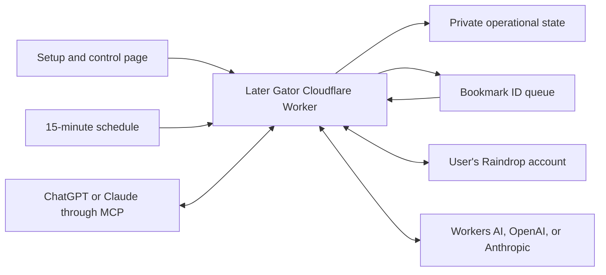

# Later Gator v1.5 Developer Guide — Legacy

> Historical reference only. This describes the retired Raindrop-backed
> architecture and is not the active Worker. Use
> `later-gator-developer-guide-v2.md` for the v6 implementation.

## The complete Later Gator mental model

Later Gator is a private automation layer sitting between Raindrop, an AI provider, and optionally ChatGPT or Claude.



There is no Later Gator bookmark database. Raindrop remains the real library and the source of truth.

Cloudflare KV stores only operational information such as:

- Whether onboarding is complete.
- Which Raindrop account was onboarded.
- Folder IDs created by Later Gator.
- The tag registry and usage counts.
- Temporary dispatch leases.
- Pause and deferral state.
- Encrypted credentials.
- Recent redacted activity.
- The internal AI-usage estimate.

Bookmark titles, URLs, excerpts, and notes are not stored there as a second library.

## 1. Deployment and first login

The Worker exposes three kinds of entry points:

1. Browser administration pages such as `/setup`.
2. Cloudflare background events: scheduled events and Queue messages.
3. The secret MCP address used by ChatGPT or Claude.

The central routing is in `src/index.ts`.

The setup password is the Cloudflare deployment's `INSTALLATION_SECRET`. When entered correctly:

- The Worker creates a signed login cookie.
- The session lasts 30 minutes.
- The password itself is not placed in the cookie.
- Forms additionally require a CSRF token and must originate from the same website.

That protection is implemented in `src/routes/setup-auth.ts`.

This setup login is separate from:

- The Raindrop token.
- OpenAI or Anthropic keys.
- The automatically generated MCP connection secret.

## 2. Credential and provider setup

The user supplies a Raindrop test token through the setup page. Later Gator:

1. Encrypts it before storing it.
2. Calls Raindrop to confirm it works.
3. Reads the connected Raindrop user identity.
4. Does not modify bookmarks merely because the token was saved.

The user then chooses one organization provider:

- Cloudflare Workers AI.
- OpenAI with the user's API key.
- Anthropic with the user's API key.

Provider testing and provider activation are separate:

- Testing proves the proposed provider/model can respond.
- Activation makes it responsible for future bookmarks.
- Changing provider does not rerun onboarding.
- Existing organized bookmarks are not reprocessed.
- MCP searches are unaffected because the connected ChatGPT or Claude model interprets search requests itself.

Workers AI requires no user API key because it is bound directly to the user's Cloudflare Worker.

## 3. Onboarding

Onboarding is intentionally separate from connection.

Saving or replacing a Raindrop token, changing the AI provider, connecting MCP, or allowing a scheduled event cannot initiate onboarding.

### Fresh account

An account is considered fresh only if it has:

- No bookmarks.
- No user-owned folders.

Later Gator then:

1. Creates the eight folders.
2. Creates the internal registry containing the 40 seed tags.
3. Marks onboarding complete.

### Existing account

Later Gator performs the reset-and-seed operation:

1. Reads the user's owned folders.
2. Moves bookmarks from those folders into Raindrop's Unsorted collection in groups of 50.
3. Clears tags from the bookmarks now in Unsorted.
4. Verifies each folder is empty.
5. Deletes the empty folders, working through nested folders safely.
6. Creates the eight Later Gator folders.
7. Initializes the 40-tag registry.
8. Marks onboarding complete.

The implementation is in `src/application/onboarding.ts`.

The process is resumable. It records the current step, so an interruption should continue from an incomplete operation instead of restarting blindly.

### Important tag distinction

The 40 seed tags initially exist in Later Gator's internal vocabulary. Raindrop generally displays a tag only after at least one bookmark actually uses it.

Therefore, `Registry tags: 40` does not mean Raindrop must immediately display 40 tags.

As bookmarks are processed, selected registry tags become attached to bookmarks and then become visible in Raindrop.

## 4. Scheduled discovery

Cloudflare triggers Later Gator every 15 minutes.

The scheduled handler:

1. Checks that a Raindrop token exists.
2. Attempts a periodic tag-registry resynchronization.
3. Reads the configured discovery batch limit.
4. Calls the discovery process.

The registry resynchronization is non-blocking. If it fails temporarily, Later Gator logs a warning and continues bookmark discovery.

The scheduled-event flow begins in `src/application/runtime-events.ts`.

Discovery is blocked when:

- Onboarding is incomplete.
- The connected account does not match the onboarded account.
- The owner paused automation.
- The pipeline has a future deferral time.
- Scheduled mode is temporarily displaced by backfill mode.

If allowed, discovery:

1. Requests up to 50 recent bookmarks from Unsorted.
2. Removes bookmarks with active temporary leases.
3. Selects up to the configured dispatch limit, currently 10.
4. Creates a 30-minute lease for each selected bookmark.
5. Sends Queue messages containing bookmark identifiers, not bookmark content.

That is implemented in `src/application/dispatch.ts`.

A lease prevents every 15-minute schedule from repeatedly enqueueing the same bookmark while an earlier message is still being handled.

## 5. Queue processing

The Queue processes one message at a time because concurrency is configured as one.

For every message, the consumer verifies:

1. The message has the expected structure.
2. Its lease still exists.
3. Its lease revision matches the message.
4. The lease has not expired.
5. Onboarding is complete.
6. The queued Raindrop account matches the onboarded account.
7. The Raindrop credential exists.
8. The AI provider can be constructed.
9. The live Raindrop account still matches.

Only after those checks does it process the bookmark.

This protects against:

- Duplicate Queue delivery.
- Old messages arriving late.
- Changing the Raindrop token to a different account.
- Missing credentials.
- Processing after lifecycle state has become unsafe.

## 6. Processing one bookmark

The main workflow is in `src/application/organize-bookmark.ts`.

### Step A: Re-fetch the bookmark

The Queue contains only an ID, so Later Gator retrieves the current bookmark from Raindrop.

If the bookmark is no longer in Unsorted, it is treated as a harmless duplicate:

- No AI call.
- No bookmark update.
- Lease cleared.
- Message acknowledged.

That makes Raindrop's current state authoritative.

### Step B: Prepare the content

Normally, the AI receives:

- Title.
- Excerpt.
- URL.
- Current tag registry and usage counts.
- Personal instructions, if configured.
- Full prompt override, if explicitly enabled.

For X or Twitter bookmarks, there is additional handling:

- Decorative `Person on X...` title text is cleaned.
- If the post clearly contains exactly one safe external URL, Later Gator may follow that URL.
- It blocks local and private network destinations.
- It caps redirects, response size, and request time.
- If safe resolution fails, it retains the original X bookmark information.

### Step C: Ask the AI

The model must return:

- One to eight tags.
- A concise retrieval-friendly description.
- One of seven content folders.
- High, medium, or low confidence.
- Optional review notes, represented as an empty string when unnecessary.

The provider receives a strict JSON format. Later Gator then validates the returned object again at runtime.

A provider connection test passing does not allow arbitrary model output to reach Raindrop.

### Step D: Validate tags

Tags are normalized by deterministic application code:

- Lowercase.
- Spaces and underscores become hyphens.
- Repeated hyphens collapse.
- Simple plurals are singularized.
- Duplicates are removed.
- Tags longer than two semantic words are rejected.
- Folder names and operational tags such as `unsorted`, `articles`, and `review` are rejected.

The AI is encouraged to reuse registry tags but may propose a new concise tag. Successful new tags are added to the registry.

The rules are implemented in `src/domain/organization-rules.ts`.

If every proposed tag is rejected, the bookmark enters the item-failure path instead of receiving an empty or malformed tag list.

### Step E: Decide the folder

Folder classification has two layers:

1. The AI proposes a folder.
2. Deterministic URL rules can override it.

Examples:

- GitHub goes to Code.
- YouTube goes to Videos & Talks.
- arXiv goes to Papers.
- Medium goes to Articles.
- X, Reddit, and LinkedIn go to Social Posts.
- A direct `.pdf` URL goes to Papers.

If the model reports low confidence, the bookmark goes to Need for Review regardless of its proposed folder.

### Step F: Preserve original information

Before replacing the Raindrop excerpt with the generated description, Later Gator appends a hidden preservation block to the note containing:

- Original URL.
- Original excerpt.

Existing notes are retained.

This is not a full backup system, but it lets Later Gator recover the original excerpt if it later encounters an empty excerpt.

### Step G: Update Raindrop

A successful update writes:

- Destination folder.
- Normalized tags.
- AI-generated description as the excerpt.
- Existing note plus preservation information.
- For a successfully resolved X external link, potentially the resolved link and page title.

After the Raindrop update succeeds:

- Tag usage counts are updated.
- Previous failure-attempt state for that bookmark is removed.
- The lease is cleared.
- The Queue message is acknowledged.

## 7. Outcome and failure scenarios

| Outcome | Meaning | What happens |
|---|---|---|
| `processed` | Valid normal classification | Bookmark moves to its content folder |
| `reviewed` | Low confidence or exhausted item retries | Bookmark moves to Need for Review |
| `duplicate` | Bookmark already left Unsorted | No AI call or mutation |
| `item_retry` | Model response or bookmark-specific result was invalid | Bookmark remains in Unsorted and can be rediscovered |
| `transient` | Temporary Raindrop, provider, or network problem | Queue retries or processing defers |
| `deferred_budget` | Later Gator's internal Workers AI estimate crossed its soft ceiling | Bookmark remains in Unsorted until the next UTC day |
| `systemic` | Credentials, folders, registry, account identity, or configuration are unsafe | Pipeline pauses for owner intervention |

### Invalid model response

Later Gator allows one corrective schema retry during the same processing attempt.

If the response is still invalid:

- The bookmark's failure count increases.
- The lease is cleared.
- It remains in Unsorted for another scheduled attempt.
- After the configured maximum, currently three, it is moved to Need for Review with the reason added to its note.

### Temporary provider failure

The Queue retries with exponential delays, beginning around one minute and growing up to one hour.

If the provider supplies a retry time too far in the future:

- Later Gator records a pipeline deferral.
- Clears the lease.
- Acknowledges the Queue message.
- Relies on future Unsorted discovery.

### Raindrop rate limiting

If Raindrop returns a reset time, Later Gator stores that as the deferral time and stops discovering new work until then.

### Systemic failure

Examples include:

- Connected Raindrop account changed.
- Required credential disappeared.
- Registry missing.
- Required folder mapping missing.
- Provider authentication or configuration failure.
- Onboarding state inconsistent.

These conditions pause the pipeline because continuing might affect the wrong account or write unreliable results.

Email is attempted only for persistent intervention-required pauses and only when email has been configured successfully.

## 8. Scheduled mode versus backfill mode

### Scheduled mode

- Runs every 15 minutes.
- Selects up to the configured batch limit.
- Queue processes those messages consecutively.
- Intended for continuously organizing newly saved bookmarks.

The batch limit controls how many IDs are discovered per schedule. It does not mean one bookmark every 15 minutes.

### Backfill mode

Backfill uses the same Queue and the same bookmark-processing logic, but discovery is initiated through the authenticated setup page.

When backfill mode is active:

- Ordinary scheduled discovery exits.
- The backfill action dispatches a bounded batch.
- The user can request another batch.
- When Unsorted is empty and no leases remain, mode returns to scheduled.

The current backfill implementation is bounded and manually continued; it is not a self-repeating process that automatically drains all existing bookmarks.

## 9. Pause, deferral, and Waiting safely

These are different states.

### Paused

A pause means no new bookmark work should start.

An owner pause writes:

- `paused: true`
- `pauseReason: paused_by_owner`
- Time of pause

Scheduled discovery sees the pause and returns without queueing more work.

Existing queued messages may still arrive. The bookmark processor sees the pause and rejects processing. Their leases can remain until the 30-minute expiry, after which the bookmarks become discoverable again when resumed.

Resume is not just a switch. It validates:

- Onboarding is complete.
- Raindrop is reachable.
- The connected user is still the onboarded user.
- The active provider passes its connection test.

### Deferred

A deferral is intended to be temporary and automatically recoverable:

- Provider rate limit.
- Raindrop rate limit.
- Workers AI budget estimate.

It stores a future `deferredUntil`. Discovery is blocked only while that timestamp remains in the future.

### UI weakness

The setup-page headline currently labels automation `Waiting safely` whenever a deferral timestamp exists, even if that timestamp is already in the past. The actual dispatch logic compares the timestamp with the present time correctly, but the display logic is less precise.

The status page can therefore potentially say `Waiting safely` even when the scheduler is technically allowed to run.

## 10. Workers AI accounting

Later Gator currently calculates its internal estimate as:

```text
estimated consumption =
700
+ title characters / 4
+ excerpt characters / 4
+ URL characters / 4
+ prompt and instruction characters / 4
+ registry characters / 4
```

It then adds that entire estimate after each successful Workers AI call.

Limitations of this approach:

1. The fixed 700 represents the maximum configured output size, not the output actually generated.
2. Characters divided by four resembles a token approximation, not Cloudflare's neuron accounting.
3. Cloudflare neuron cost depends on model execution and is not equal to one estimated token.
4. Later Gator does not query Cloudflare's actual daily usage.
5. The resulting number is displayed and enforced as if it represented real neurons.
6. Consequently, the internal guard can stop processing even while the Cloudflare account remains well below its real allowance.

The safeguard's intent is to leave room below Cloudflare's hard free limit, but its present measurement model is not calibrated to the real Cloudflare usage metric.

## 11. Tag registry lifecycle

The registry begins with 40 tags, each with a usage count of zero.

After a successful bookmark:

- Selected tags have their counts incremented.
- Newly accepted tags enter the registry.
- Most-used tags appear earlier in future AI prompts.
- This encourages consistency over time.

A periodic registry resync can rebuild counts from the actual Raindrop library. That protects against drift if the user manually changes tags in Raindrop.

The registry is guidance, not a list forcibly created inside Raindrop.

## 12. MCP workflow

Later Gator generates a long random MCP secret and places it in the connection URL. The user does not need to invent or remember it.

ChatGPT or Claude can then call four tools:

- `get_context`: folders, tags, counts, timezone, and date.
- `search_bookmarks`: text, tag, folder, and date-constrained Raindrop search.
- `get_pipeline_status`: onboarding, pending work, account match, provider, and pause or deferral state.
- `resume_pipeline`: validates the account and provider before clearing a real pause.

MCP cannot:

- Start onboarding.
- Reset the Raindrop account.
- Change providers.
- Modify arbitrary bookmarks.
- Trigger destructive maintenance.

Rotating the MCP address invalidates the previous address.

## 13. What is deliberately protected

The implementation makes several safety choices:

- Raindrop is always authoritative.
- Queue messages contain IDs rather than bookmark content.
- Credentials are encrypted before KV storage.
- Bookmark contents and tokens are excluded from logs.
- Every external response is validated.
- Account identity is repeatedly checked.
- Duplicate Queue deliveries are harmless.
- Folder creation happens during onboarding, not opportunistically.
- A malformed AI response cannot be written directly to Raindrop.
- A provider change only affects future bookmarks.
- Onboarding requires explicit authenticated action.
- Resume requires revalidation.
- Routine transient problems do not trigger destructive recovery.
