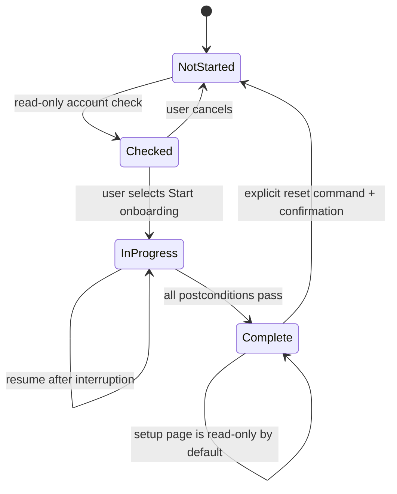
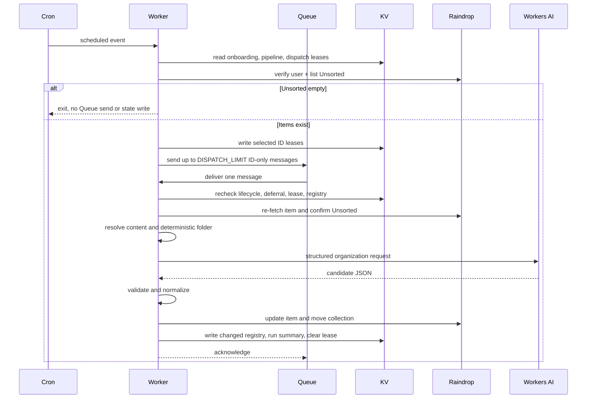

# Later Gator — Technical Design Document v1.4

**Status:** Ready for implementation after review  
**Product requirements:** Later Gator PRD v5.4  
**Target runtime:** Cloudflare Workers  
**Primary language:** TypeScript  
**Last verified against provider documentation:** 2026-07-23  

---

## 1. Purpose

This document translates the Later Gator PRD into an implementable technical design. It defines system boundaries, runtime entry points, data contracts, storage schemas, state transitions, safety rules, failure handling, security controls, tests, and delivery phases.

This document is authoritative for implementation details. The PRD remains authoritative for product intent and scope. If the two conflict, stop and resolve the discrepancy rather than silently changing product behavior.

---

## 2. Design summary

Later Gator v1 will be a single, stateless Cloudflare Worker with four entry surfaces:

1. A scheduled handler for routine organization.
2. A Queue consumer handler for one-bookmark organization jobs.
3. A Streamable HTTP MCP endpoint for search and pipeline operations.
4. An authenticated, Worker-hosted setup and administration page backed by private administrative HTTP endpoints.

The Worker uses:

- Raindrop as the bookmark system of record.
- Workers KV for small, low-write operational state.
- Cloudflare Queues for short-lived, per-bookmark delivery and retry isolation.
- Workers AI for default organization-model inference, or a supported external provider using the user's own API key.
- Cloudflare Email Service as the core persistent-pause alert mechanism when the deployment has the required routing domain and verified recipient.
- A minimal server-rendered setup page that becomes the permanent settings and status page after onboarding.

No Durable Object, D1 database, Workflow, R2 bucket, vector store, or bookmark/search frontend is required for v1. The setup/settings page is a private administration surface, not a bookmark application.

### 2.1 Core architectural decisions

| Decision | Choice | Reason |
|---|---|---|
| Worker topology | One Worker | Keeps deployment and secrets simple for a single tenant |
| MCP transport | Stateless Streamable HTTP | Current remote MCP standard; tools do not need session state |
| MCP implementation | `createMcpHandler()` with a fresh server per request | Avoids a Durable Object and request-state leakage |
| Operational state | Workers KV | Small, read-heavy state with infrequent writes |
| Work delivery | One Cloudflare Queue; ID-only messages | Lets Cron discover a batch while each bookmark receives a separate free-tier invocation |
| Coordination model | Queue consumer `max_batch_size=1`, `max_concurrency=1`, plus idempotency | Preserves sequential vocabulary updates and contains per-item CPU/retry cost |
| Installation | Deploy to Cloudflare button in the public repository README | Copies the repository, provisions declared resources, collects only bootstrap configuration, and deploys without a local toolchain |
| Credential management | Authenticated setup/settings forms plus AES-GCM-encrypted KV envelopes | Lets the user enter and replace Raindrop, OpenAI, and Anthropic keys inside Later Gator without returning stored values to the browser |
| Onboarding execution | Authenticated setup page orchestrating a small reset-and-seed sequence | Implements only the fresh or existing-account behavior approved by the product |
| Organization inference | Provider interface with Workers AI default plus Anthropic/OpenAI BYOK adapters | Default is simple and low-friction while preserving user choice |
| Default model | README-named Workers AI model | Can change by release as availability and free-tier economics change |
| Runtime validation | Zod at every external boundary | Provider JSON Mode is helpful but not a correctness guarantee |
| Alert delivery | Cloudflare Email binding with explicit readiness state | Core intervention alerting without a third-party mail provider; domain/recipient prerequisites remain visible |

---

## 3. System context

```mermaid
flowchart LR
    U["User"] --> README["GitHub README and Deploy Button"]
    U --> SETUP["Authenticated setup page"]
    U --> CLIENT["ChatGPT or Claude MCP client"]
    README -->|"Workers Builds deploy"] WORKER["Later Gator Worker"]
    SETUP -->|"Admin HTTPS"] WORKER
    CLIENT -->|"Streamable HTTP MCP"] WORKER
    CRON["Cloudflare Cron"] --> WORKER
    WORKER -->|"ID-only messages"] QUEUE["Cloudflare Queue"]
    QUEUE -->|"One message at a time"] WORKER
    WORKER -->|"REST API"] RD["Raindrop"]
    WORKER -->|"Binding"] AI["Workers AI"]
    WORKER -->|"HTTPS with user key"] EXT["Anthropic or OpenAI"]
    WORKER -->|"Binding"] KV["Workers KV"]
    WORKER -->|"When email_ready"] EMAIL["Cloudflare Email Service"]
```

### 3.1 Trust boundaries

- The setup page is an administrator surface and may initiate destructive onboarding operations only after installation-secret authentication and confirmation.
- MCP clients are authorized users but receive only the four PRD-approved MCP tools.
- Raindrop, Workers AI, optional BYOK providers, and Cloudflare Email Service are external dependencies whose responses are untrusted until validated.
- Bookmark URLs are untrusted network targets and must pass URL and redirect safety checks.
- KV data is internal but versioned and validated because schemas will evolve.

---

## 4. Runtime and project structure

### 4.1 Technology choices

- TypeScript with strict compiler settings.
- Cloudflare Workers module syntax.
- `wrangler.jsonc` for deployment configuration.
- Zod for runtime schemas and MCP input/output schemas.
- `@modelcontextprotocol/sdk` plus Cloudflare Agents SDK MCP helpers.
- Vitest with Cloudflare's Workers test pool for runtime tests.
- Small maintainer scripts may exist for development and tests, but no local CLI is required for end-user installation or onboarding.
- No general web framework in v1; route count is small enough for an explicit router.

### 4.2 Proposed repository layout

```text
later-gator/
├── src/
│   ├── index.ts                    # fetch, scheduled, and queue entry points
│   ├── config.ts                   # validated non-secret configuration
│   ├── routes/
│   │   ├── mcp.ts                  # MCP handler and tools
│   │   ├── setup-page.ts           # server-rendered setup/admin UI
│   │   ├── admin.ts                # setup/backfill JSON endpoints
│   │   └── health.ts
│   ├── application/
│   │   ├── dispatch-unsorted.ts
│   │   ├── organize-bookmark.ts
│   │   ├── onboarding.ts
│   │   ├── backfill.ts
│   │   ├── search.ts
│   │   ├── registry-resync.ts
│   │   └── pipeline-control.ts
│   ├── domain/
│   │   ├── bookmark.ts
│   │   ├── folders.ts
│   │   ├── tags.ts
│   │   ├── lifecycle.ts
│   │   ├── failures.ts
│   │   └── schemas.ts
│   ├── adapters/
│   │   ├── encrypted-credential-store.ts
│   │   ├── raindrop-client.ts
│   │   ├── workers-ai-organizer.ts
│   │   ├── anthropic-organizer.ts
│   │   ├── openai-organizer.ts
│   │   ├── organizer-factory.ts
│   │   ├── kv-state-store.ts
│   │   ├── cloudflare-email-alerts.ts
│   │   ├── organization-queue.ts
│   │   └── safe-url-resolver.ts
│   ├── prompts/
│   │   ├── organization-prompt.ts
│   │   └── organization-schema.ts
│   ├── seed/
│   │   ├── seed-v1.ts
│   │   ├── domain-map.ts
│   │   └── examples.ts
│   └── observability/
│       ├── logger.ts
│       └── metrics.ts
├── test/
│   ├── unit/
│   ├── integration/
│   ├── contract/
│   ├── fixtures/
│   └── evals/
├── scripts/
├── README.md                       # canonical installation and operation guide
├── .dev.vars.example              # deployment secret prompts and local template
├── wrangler.jsonc
├── tsconfig.json
├── vitest.config.ts
└── package.json
```

### 4.3 Worker bindings and configuration

Bindings:

| Binding | Type | Purpose |
|---|---|---|
| `STATE` | KV namespace | Lifecycle, registry, attempts, pause state, and small caches |
| `AI` | Workers AI | Organization-model inference |
| `ORGANIZE_QUEUE` | Cloudflare Queue producer and same-Worker consumer | ID-only organization jobs with sequential delivery |
| `EMAIL` | Cloudflare Email Service, configured when prerequisites exist | Core persistent-pause alerts to a verified destination |

Bootstrap deployment secrets:

| Secret | Purpose |
|---|---|
| `MCP_PATH_SECRET` | Secret segment in the MCP URL |
| `INSTALLATION_SECRET` | Authentication for the setup and administration page and the root material used to encrypt credentials entered there |

Credentials entered in the authenticated application:

| Credential | Purpose |
|---|---|
| Raindrop token | Raindrop API authentication |
| Anthropic API key | Used only when the user selects Anthropic |
| OpenAI API key | Used only when the user selects OpenAI |

Non-secret variables:

| Variable | Initial value or meaning |
|---|---|
| `LLM_PROVIDER` | First-run default only: `workers-ai`; active choice then lives in versioned KV settings |
| `LLM_MODEL` | First-run recommended model only; active/candidate identifiers then live in versioned KV settings |
| `SEED_VERSION` | Current seed identifier |
| `DISPATCH_LIMIT` | `10` IDs discovered per Cron run by default |
| `ITEM_MAX_ATTEMPTS` | `3` |
| `WORKERS_AI_DAILY_SOFT_LIMIT` | Conservative budget below the current published free allocation |
| `ALERT_EMAIL` | User-selected verified destination owned by the user |
| `ALERT_FROM` | Address on the user's Cloudflare-managed routing domain |
| `ENVIRONMENT` | `development`, `test`, or `production` |

Configuration requirements:

- Use a current compatibility date when the project is created and update it deliberately.
- Enable `nodejs_compat` only because selected dependencies require it.
- Generate Worker binding types from Wrangler configuration; do not hand-write `Env`.
- Enable structured observability with a conservative head sampling rate.
- Never put secrets in `wrangler.jsonc`, source, fixtures, or logs.

### 4.4 Deploy to Cloudflare repository contract

The repository is a public, single-Worker GitHub repository so it can use Cloudflare's Deploy Button flow.

README badge:

```md
[](https://deploy.workers.cloudflare.com/?url=https://github.com/<owner>/<repo>)
```

Repository requirements:

- The default `wrangler.jsonc` declares the `STATE` KV binding without an account-specific namespace ID, `AI`, a Queue producer named `ORGANIZE_QUEUE`, a same-Worker consumer with `max_batch_size: 1` and `max_concurrency: 1`, Cron configuration, and safe non-secret defaults.
- The Deploy Button provisions and binds the Queue with the other supported Cloudflare resources.
- Email is a first-setup checklist item. The repository documents the `EMAIL` binding, but the setup page reports `email_needs_domain` or `email_needs_verification` until the owner configures a Cloudflare routing domain and verifies the chosen destination. The owner may explicitly continue as `email_unavailable` when no domain exists.
- `.dev.vars.example` declares only bootstrap secrets required for deployment and local development. Raindrop and external-provider credentials are entered later in `/setup`.
- `package.json.cloudflare.bindings` supplies a concise description and authoritative key-acquisition link for every secret and configurable binding.
- The default deployment uses `LLM_PROVIDER=workers-ai`; neither Anthropic nor OpenAI credentials are needed for that path.
- Cloudflare Workers Builds performs the deployment and automatically provisions supported declared resources, including KV and Workers AI.
- The generated repository belongs to the user and subsequent pushes deploy through its connected Workers Build.
- The README links to `https://<deployed-worker>/setup` as the next step.

The Deploy Button performs infrastructure deployment. It does not authorize destructive Raindrop onboarding and does not choose or validate an external model provider.

### 4.5 README contract

`README.md` is the sole end-user setup document. It contains, in order:

1. What Later Gator changes in Raindrop during the simple fresh or existing-account onboarding path.
2. The first-setup choice among Workers AI, OpenAI, and Anthropic, with Workers AI recommended and requiring no external key.
3. A BYOK path explaining Anthropic and OpenAI key requirements and costs before the user reaches provider validation.
4. The Deploy to Cloudflare button.
5. A field-by-field explanation of every value shown by the deploy form.
6. The post-deploy `/setup` URL and installation-secret login.
7. A plain-language explanation of installation validation versus onboarding.
8. Mode A and Mode B consequences.
9. Queue-backed automation, backfill, MCP client connection, provider switching, prompt settings, secret rotation, and uninstall instructions.
10. The card-free operating limits, silent deferral behavior, Cloudflare email domain/recipient verification, and a troubleshooting table.

No required installation instruction may exist only in a separate documentation site, local script, or maintainer note.

---

## 5. HTTP and event entry points

### 5.1 Route table

| Method and route | Authentication | Purpose |
|---|---|---|
| `GET /health` | None | Liveness only; no account or state details |
| `GET /setup` | Installation-secret session | Server-rendered onboarding before setup; permanent settings and status UI afterward |
| `POST /setup/login` | Installation secret | Establish a short-lived secure setup session |
| `POST /setup/logout` | Setup session | End the setup session |
| `POST /mcp/:secret` | Constant-time path-secret check | Streamable HTTP MCP requests |
| `GET /mcp/:secret` | Constant-time path-secret check | Transport-required stream behavior if requested by the MCP handler |
| `GET /admin/credentials/status` | Setup session | Return configured/missing status and timestamps without credential values |
| `POST /admin/credentials/raindrop` | Setup session plus CSRF | Enter or replace the encrypted Raindrop token |
| `POST /admin/credentials/provider` | Setup session plus CSRF | Enter or replace an encrypted OpenAI or Anthropic key |
| `POST /admin/credentials/provider/remove` | Setup session plus CSRF | Remove one selected external-provider key |
| `POST /admin/installation/validate` | Setup session | Validate KV/AI/Queue, stored Raindrop credentials, provider, and core-email readiness without mutation |
| `POST /admin/onboarding/check` | Setup session | Count bookmarks and folders and select fresh or existing mode |
| `POST /admin/onboarding/start` | Setup session | Begin the selected onboarding path |
| `POST /admin/onboarding/continue` | Setup session | Execute one bounded, resumable chunk |
| `GET /admin/status` | Setup session | Full administrative status |
| `POST /admin/provider/test` | Setup session | Run one credential/model/response connection check without bookmark content |
| `POST /admin/provider/activate` | Setup session | Activate a successfully tested candidate configuration for future items |
| `POST /admin/settings/prompt` | Setup session | Save personal instructions or an advanced prompt override |
| `POST /admin/backfill/start` | Setup session | Begin explicit backfill mode |
| `POST /admin/backfill/continue` | Setup session | Execute one bounded batch |
| `POST /admin/backfill/finish` | Setup session | Return to scheduled mode |
| `POST /admin/onboarding/reset` | Setup session plus confirmation | Explicitly reset completed onboarding |

All other routes return 404. Invalid MCP secrets return a bare 401. Invalid or expired setup sessions return a bare 401 from JSON endpoints or the login page from browser navigation. Error bodies on authenticated routes use the structured error envelope in Section 16.

### 5.2 Scheduled entry point

The `scheduled()` handler calls `dispatchUnsorted()` rather than performing LLM work. After lifecycle, pause, deferral, and account guards, it lists the newest Unsorted items, removes IDs with live dispatch leases, writes one compact lease update, and sends up to `DISPATCH_LIMIT` ID-only messages through `ORGANIZE_QUEUE.sendBatch()`.

No HTTP route can impersonate the production scheduled event. Local scheduled testing uses Wrangler's supported scheduled-test path.

### 5.3 Queue entry point

The `queue()` handler receives one message because the consumer is configured with `max_batch_size=1`. It validates the message, rechecks lifecycle/account/pause state and current deferral, confirms the bookmark is still in Unsorted, then calls `organizeBookmark()`.

- Success, harmless duplicate, item moved to Need for Review, or known daily-budget deferral: acknowledge the message and clear or expire its dispatch lease as appropriate.
- Provider or Raindrop rate limit with a reset inside Queue retention: retry the message with a bounded delay derived from the reset header.
- Daily AI reset or another delay that could approach Queue's 24-hour free retention: acknowledge the message, set pipeline `deferredUntil`, and leave the bookmark in Unsorted for rediscovery after reset.
- Malformed messages are acknowledged and logged without calling external services.

The queue contains no bookmark text. Raindrop Unsorted remains authoritative if a message is lost, expires, or is delivered more than once.

---

## 6. Persistent state design

KV is eventually consistent. The design therefore does not use KV for atomic compare-and-set, money-like counters, or correctness that depends on immediate cross-location read-after-write. All state transitions are idempotent, and rapid setup-page calls carry the last response cursor forward rather than assuming the next edge has observed the latest KV value.

### 6.1 Key layout

| Key | Value | Write pattern |
|---|---|---|
| `installation:v1` | `InstallationState` | After successful validation or provider/configuration change |
| `credentials:v1` | `EncryptedCredentialState` | When the authenticated user enters, replaces, or removes a Raindrop or provider key |
| `onboarding:v1` | `OnboardingState` | After each completed onboarding chunk |
| `pipeline:v1` | `PipelineState` | On pause/resume, run completion, and backfill mode change |
| `registry:v1` | `RegistryState` | Once per changed organization run or resync |
| `provider-config:v1` | `ProviderConfigState` | Candidate test and active provider/model/prompt revisions |
| `dispatch:v1` | `DispatchState` | Short leases for IDs handed to Queue and last Cron discovery summary |
| `email-config:v1` | `EmailConfigState` | Recipient, sender, readiness, test, and last alert outcome |
| `ai-usage:YYYY-MM-DD` | `AiUsageState` | Conservative Workers AI daily free-budget accounting |
| `resync:v1` | `ResyncState` | Once per resync run |

### 6.2 Installation state

```ts
type InstallationState = {
  schemaVersion: 1;
  configurationFingerprint: string;
  provider: "workers-ai" | "anthropic" | "openai";
  model: string;
  raindropUserId: number;
  bindingsValid: boolean;
  providerValid: boolean;
  emailStatus: "ready" | "needs_domain" | "needs_verification" | "unavailable";
  validatedAt: string;
};
```

The fingerprint covers required bindings, seed version, and non-secret installation configuration. Provider activation is tracked separately so testing a candidate does not interrupt the active provider. It never contains or exposes an API key.

### 6.3 Onboarding state

```ts
type OnboardingStatus = "not_started" | "in_progress" | "complete";
type OnboardingMode = "fresh" | "existing";

type OnboardingState = {
  schemaVersion: 1;
  status: OnboardingStatus;
  accountUserId: number | null;
  mode: OnboardingMode | null;
  startedAt: string | null;
  completedAt: string | null;
  currentStep: OnboardingStep | null;
  cursor: string | null;
  folderIds: Partial<Record<FolderName, number>>;
  seedVersion: string | null;
  revision: number;
};
```

The stored `cursor` is an opaque, versioned application cursor rather than a raw array index. The setup page also sends back the latest cursor it received. Replaying a stale cursor is safe because every chunk checks its Raindrop postcondition before writing.

### 6.3.1 Encrypted credential state

```ts
type EncryptedValue = {
  algorithm: "AES-GCM";
  keyDerivation: "HKDF-SHA-256";
  nonce: string;
  ciphertext: string;
  updatedAt: string;
};

type EncryptedCredentialState = {
  schemaVersion: 1;
  raindrop: EncryptedValue | null;
  anthropic: EncryptedValue | null;
  openai: EncryptedValue | null;
  revision: number;
};
```

The Worker derives a non-extractable AES-256-GCM key from `INSTALLATION_SECRET` using HKDF-SHA-256 with a fixed application context and a deployment-specific salt stored alongside the encrypted document. Every write uses a fresh 96-bit nonce and provider-specific additional authenticated data. KV stores only ciphertext and metadata. API responses expose only `configured`, `updatedAt`, and validation status. Rotating `INSTALLATION_SECRET` intentionally makes the stored credentials unreadable; the settings page then asks the user to enter them again.

### 6.4 Pipeline state

```ts
type PipelineState = {
  schemaVersion: 1;
  mode: "scheduled" | "backfill";
  paused: boolean;
  pauseReason: PipelinePauseReason | null;
  pausedAt: string | null;
  deferredUntil: string | null;
  deferredReason: "raindrop_rate_limit" | "provider_rate_limit" | "workers_ai_daily_budget" | null;
  backfillSessionId: string | null;
  lastRun: {
    runId: string;
    source: "queue" | "backfill";
    startedAt: string;
    finishedAt: string;
    selected: number;
    processed: number;
    reviewed: number;
    deferred: number;
    failed: number;
  } | null;
  systemicFailureStreak: {
    provider: "raindrop" | "workers_ai" | "anthropic" | "openai" | "cloudflare_email" | null;
    distinctBookmarkIds: number[];
    code: string | null;
  };
  revision: number;
};
```

### 6.5 Dispatch and email state

```ts
type DispatchState = {
  schemaVersion: 1;
  leases: Record<string, {
    dispatchRevision: string;
    expiresAt: string;
  }>;
  lastDiscoveryAt: string | null;
  lastDiscovered: number;
  lastEnqueued: number;
  revision: number;
};

type EmailConfigState = {
  schemaVersion: 1;
  recipient: string | null;
  from: string | null;
  status: "ready" | "needs_domain" | "needs_verification" | "unavailable";
  testSentAt: string | null;
  lastDeliveryAt: string | null;
  lastDeliveryCode: string | null;
  revision: number;
};
```

The recipient may be any address the user controls. `ready` requires the binding, a sender on a Cloudflare routing domain, a verified destination, and a successful test. Neither document contains bookmark content.

### 6.6 Registry state

```ts
type RegistryState = {
  schemaVersion: 1;
  seedVersion: string;
  tags: Record<string, {
    count: number;
    firstUsedAt: string;
    lastUsedAt: string;
  }>;
  attempts: Record<string, {
    count: number;
    lastReason: string;
    lastAttemptAt: string;
  }>;
  updatedAt: string;
  source: "automation" | "resync";
};
```

Attempt entries are removed after success or after the item is moved to Need for Review. This prevents unbounded KV growth.

### 6.7 Provider configuration and AI usage state

```ts
type ProviderChoice = {
  provider: "workers-ai" | "anthropic" | "openai";
  model: string;
  promptRevision: number;
};

type ProviderConfigState = {
  schemaVersion: 1;
  active: ProviderChoice;
  candidate: ProviderChoice | null;
  candidateTestedAt: string | null;
  candidateTestSucceeded: boolean;
  personalInstructions: string;
  fullPromptOverride: string | null;
  revision: number;
};

type AiUsageState = {
  schemaVersion: 1;
  utcDate: string;
  estimatedNeurons: number;
  calls: number;
  lastUpdatedAt: string;
};
```

The candidate can replace `active` only after the live connection check succeeds. Routine processing reads `active` once per item. `AiUsageState` is a conservative guardrail, not billing data; Cloudflare remains authoritative for actual account usage.

### 6.8 State migrations

- Every KV document includes `schemaVersion`.
- Reads parse the exact current schema or run a pure migration function.
- Migrations are additive and tested against frozen previous-version fixtures.
- A failed migration pauses mutation paths and leaves the original value untouched.

---

## 7. Installation validation and onboarding design

### 7.1 Three-stage user experience

The README and setup page are the supported end-user interfaces.

```text
README Deploy Button
  → Cloudflare copies the repository and deploys declared infrastructure
  → user opens /setup and authenticates with INSTALLATION_SECRET
  → user enters the Raindrop token in the authenticated page
  → user chooses Workers AI, OpenAI, or Anthropic and a model
  → if external AI is selected, user enters the provider key in the page
  → setup tests and activates that provider before onboarding
  → user optionally adds personal instructions
  → user enters any controlled notification email and completes Cloudflare verification/domain checks
  → setup validates KV, AI, Queue, Raindrop, provider, and email readiness
  → setup counts bookmarks and user folders
  → page displays the fresh or existing-account onboarding actions
  → user selects Start onboarding
  → setup runs the small seed or reset-and-seed sequence
  → routine automation gradually sorts Unsorted
```

### 7.2 First-setup choices and installation validation

The wizard stores no onboarding state and performs no Raindrop mutation while these choices are made. Workers AI is preselected, but OpenAI and Anthropic are equally available before onboarding. Selecting an external provider reveals a blank password-style key field. Submitting that field replaces the encrypted stored key, runs the synthetic connection check, and activates the choice only after success.

Installation validation is read-only with respect to Raindrop and runs before onboarding:

1. Read and write a disposable validation key in the `STATE` binding, then delete it.
2. Confirm that the `AI` and `ORGANIZE_QUEUE` bindings are present. Invoke AI only when the candidate provider is `workers-ai`; never enqueue during validation.
3. Decrypt the Raindrop token entered in setup, call `GET /user`, and record the authenticated user ID.
4. Resolve the selected provider adapter and decrypt the corresponding stored credential when needed.
5. Make a minimal structured-output inference request that uses no bookmark content.
6. Store optional personal instructions and the initial prompt revision.
7. Validate the email recipient, sender, binding, routing-domain eligibility, and test send. Record the exact readiness state rather than a boolean.
8. If email is not ready, require explicit acknowledgement of `email_unavailable` before continuing; do not describe email as configured.
9. Compute and store the non-secret configuration fingerprint.

Provider rules:

| Candidate provider | Required runtime credential | Validation behavior |
|---|---|---|
| `workers-ai` | `AI` binding | Call the configured Workers AI model |
| `anthropic` | Encrypted Anthropic key entered in setup/settings | Decrypt only for the outbound call and require a valid test response |
| `openai` | Encrypted OpenAI key entered in setup/settings | Decrypt only for the outbound call and require a valid test response |

Adding a key does not select it. Selection is controlled by the active/candidate provider settings stored in KV; `LLM_PROVIDER` and `LLM_MODEL` only seed the first page load. If the required key is absent, the setup page fails closed and asks the user to enter it. A stored value is never returned or prefilled; the page shows only configured, missing, or test failed.

### 7.3 Onboarding account check

The check performs only read operations:

1. `GET /user` to verify credentials and obtain the stable Raindrop user ID.
2. Fetch root and child collections.
3. Count all non-Trash bookmarks.
4. Select `fresh` only when bookmark count and user-folder count are both zero; otherwise select `existing`.
5. Display the corresponding actions and wait for the user to select **Start onboarding**.

### 7.4 State machine



`Checked` is a browser-display state, not a persisted onboarding status. KV remains `not_started` until the start request succeeds.

### 7.5 Mode A — Fresh account

Mode A requires only a few writes and normally completes in one bounded request:

1. Recheck that the account still has zero bookmarks and zero user folders.
2. Create or recover each standard folder by exact title.
3. Verify all eight folder IDs.
4. Initialize the seed tag registry.
5. Store account user ID, folder map, and seed version.
6. Mark complete.

Raindrop tags are materialized when applied to bookmarks, so seed tags initially live in the Later Gator registry.

### 7.6 Mode B — Existing-account steps

| Step | Operation | Chunking | Completion check |
|---|---|---|---|
| `move_to_unsorted` | Bulk move bookmarks from each owned collection to collection `-1` | Per source collection and ID page | Each source collection contains zero bookmarks |
| `clear_tags` | Bulk set tags to `[]` for every bookmark in Unsorted | ID batches | All target items have no tags |
| `delete_collections` | Delete former user collections after empty checks | Leaf-first, one at a time | Collection is absent after a verified-empty check |
| `create_folders` | Create or recover the eight standard folders | One at a time | Eight valid owned folder IDs are recorded |
| `initialize_registry` | Create the versioned seed tag registry | One KV write | Registry contains the seed vocabulary |
| `complete` | Persist identity, seed, folder map, completion time | One KV write | State reads back as complete eventually; response is immediately authoritative to the setup page |

Onboarding does not change excerpts, notes, descriptions, URLs, titles, IDs, or save dates. It does not organize individual bookmarks. Once onboarding completes, normal scheduled processing and optional backfill gradually organize Unsorted.

### 7.7 Collection deletion safety

Deleting a non-empty Raindrop collection moves its contents to Trash. Therefore deletion requires both checks immediately before the delete call:

- The collection's reported count is zero.
- Listing its first page returns no items.

Nested collections are deleted leaf-first. Before deleting a parent, every descendant must already be absent and the parent must pass both empty checks. This prevents Raindrop's cascading collection deletion behavior from moving descendant content to Trash.

### 7.8 Resume behavior

- Every continuation request includes step, cursor, and setup session ID.
- The Worker rejects a different Raindrop user ID.
- The Worker may accept a stale cursor only by replaying idempotent checks.
- The response returns the authoritative next step and cursor to the setup page.
- If KV propagation is delayed, the setup page continues from its response state. After an interruption, KV may replay the last chunk; replay remains safe.

---

## 8. Routine organization pipeline

### 8.1 Cron dispatcher guards

The scheduled handler performs guards in this order:

1. Load and validate onboarding state.
2. Exit unless status is complete.
3. Call `GET /user` and compare the user ID with the onboarded ID.
4. On mismatch, pause systemically and alert.
5. Load pipeline state.
6. Exit if paused or if mode is `backfill`.
7. Exit while `deferredUntil` is in the future.
8. Fetch at most `DISPATCH_LIMIT` items from Unsorted, newest first.
9. Exclude IDs with unexpired dispatch leases.
10. Exit without Workers AI, Queue sends, or unchanged KV writes when no eligible items remain.
11. Write one dispatch revision containing leases for selected IDs, then send their ID-only messages in one Queue binding call.

### 8.2 Dispatch and consumption sequence



### 8.3 Per-bookmark algorithm

1. Validate the Queue message and require bookmark ID, onboarded Raindrop user ID, dispatch revision, and enqueue timestamp only.
2. Re-fetch the item and acknowledge without work if it is no longer in Unsorted.
3. Capture original URL, title, excerpt, note, tags, collection, ID, and creation date.
4. Derive the source excerpt: use the current excerpt when non-empty; otherwise recover it only from a valid Later Gator preservation block in the note. Never treat arbitrary user-note text as source content.
5. Resolve X-specific deterministic content when applicable.
6. Determine folder by domain map, then PDF override; leave unresolved fallback to the model.
7. Build the prompt from seed, worked examples, the latest registry, and bookmark content.
8. Call the organization model using JSON Mode.
9. Validate the response and retry once for schema-only failures.
10. Normalize and validate tags.
11. Coerce folder output according to routing precedence.
12. If confidence is low, prepare a Need for Review update and reason. A validated model `notes` value may be included only in this operational review block; it is not written for normal success.
13. Ensure the note contains a preservation block with the original URL and, when present, the original excerpt. Do this even when the original excerpt is empty, and never change existing user note text.
14. Fetch the bookmark once more only when a safety-sensitive assumption changed during resolution; otherwise avoid the extra subrequest.
15. Update the bookmark in place with a single Raindrop `PUT` wherever possible.
16. Only after the Raindrop update succeeds, merge tags into the registry, clear its attempt entry and dispatch lease, then acknowledge the Queue message.

The update payload never sends `created`, ensuring the original save date remains unchanged.

### 8.4 At-least-once behavior

Queue delivery is at least once. `max_batch_size=1` and `max_concurrency=1` serialize ordinary consumers, while dispatch leases reduce duplicate enqueueing. Backfill uses the same Queue and changes only the dispatch mode.

If a message is delivered twice, or Cron overlaps before KV propagation, safety is preserved because:

- Updates are in-place and deterministic at the bookmark level.
- Preservation blocks are idempotent.
- Moving the item out of Unsorted removes it from future runs.
- Registry increments occur only after a successful Raindrop update.
- The periodic registry resync repairs count drift.

The consumer rechecks Unsorted before inference, so the normal duplicate path is an acknowledged no-op. A narrow race can still duplicate inference cost, but the bookmark update remains idempotent and registry resync repairs count drift. If telemetry shows unacceptable duplication, add a coordinator Durable Object in a later design revision.

### 8.5 Subrequest budget

The Free plan currently documents 50 external subrequests per invocation and six simultaneously open connections. Each consumer receives one bookmark, preserving CPU and subrequest headroom while allowing the Queue to invoke the next item promptly.

A `SubrequestBudget` tracks explicit Raindrop and external URL calls and stops the item when the conservative external-call budget reaches 20. Queue messages remain under one 64 KB operation unit. A normal delivered message consumes approximately three Queue operations—write, read, and delete—and the current free allowance is far above the expected single-user volume.

Processing remains sequential, so simultaneous connection count stays low.

---

## 9. Content and URL resolution

### 9.1 X detection

Treat a bookmark as an X post when the normalized hostname is `x.com`, `twitter.com`, or an approved subdomain of either. Do not classify a hostname merely because it contains those strings.

When a bookmark's current excerpt is empty, a valid Later Gator preservation block from an earlier organization attempt may supply the original excerpt. Onboarding itself never clears excerpts.

### 9.2 Title cleanup

Apply a conservative wrapper parser for titles shaped like:

```text
<author> on X: "<body>" / X
```

If the parser cannot confidently match the wrapper, retain the original title. Remove only trailing `t.co` fragments that are separately recognized as URLs.

### 9.3 Candidate extraction

- Extract HTTP(S) URLs from title and excerpt, title first.
- Exclude direct X/Twitter URLs.
- Preserve document order.
- v1 implements only the PRD's baseline single-candidate path. It does not add duplicate detection, extra bookmark creation, or a new multi-link decision system.

### 9.4 Safe redirect resolution

Every candidate is untrusted:

- Allow only `http:` and `https:`.
- Reject embedded credentials.
- Reject loopback, link-local, private, multicast, unspecified, and cloud-metadata destinations when detectable.
- Allow only standard web ports.
- Follow redirects manually, validate each `Location`, and stop after five redirects.
- Use an abort deadline.
- Do not forward Raindrop, MCP, admin, or external-provider credentials.
- If the final hostname is X/Twitter, discard the candidate as self-referential media.

Use `HEAD` for resolution. If a server rejects `HEAD`, use a bounded `GET` without retaining the body beyond what is needed for the title.

### 9.5 Destination title

For a valid substitution, retrieve the destination title with a bounded read:

- Reject clearly non-HTML content for title extraction unless the deterministic folder rule handles it, such as PDF.
- Enforce a small byte ceiling before buffering content.
- Stop parsing once `<title>` is captured.
- Normalize whitespace and enforce Raindrop's title length limit.
- Fall back to the cleaned post title or destination hostname when no safe title is available.

Never call `response.text()` on an unbounded response.

### 9.6 Substitution write

When the PRD's baseline criteria pass:

- Set `link` to the final external URL.
- Set `title` to the resolved destination title.
- Preserve the original post URL and excerpt in the note block.
- Use routing based on the destination.
- Update the existing bookmark ID.
- Do not send a new `created` value.

---

## 10. Folder routing

### 10.1 Routing function

```text
route(url, modelFolder):
  if hostname matches domain map → mapped folder
  else if URL path ends in .pdf → Papers
  else if modelFolder is one of seven content folders → modelFolder
  else → Websites & Apps
```

Need for Review is selected only by pipeline failure/confidence logic, not by ordinary content classification.

### 10.2 Domain matching

- Normalize hostnames with URL parsing and lowercase ASCII form.
- Match exact host or label-bound suffix, so `github.com` matches `docs.github.com` but not `github.com.attacker.example`.
- Keep the map in the versioned seed.
- Unit-test every domain entry and precedence collision.

### 10.3 Folder IDs

Business logic uses stable folder names. The Raindrop adapter resolves names to IDs from completed onboarding state. A missing or inaccessible ID is systemic configuration failure and pauses the pipeline.

---

## 11. Tag normalization and registry

### 11.1 Normalization pipeline

For each proposed tag:

1. Unicode-normalize with NFKC.
2. Trim and lowercase.
3. Replace whitespace and underscores with a single hyphen.
4. Collapse repeated hyphens and remove edge punctuation.
5. Split into semantic words; reject more than two words.
6. Apply conservative singularization.
7. Reject empty tags, source-type tags, and reserved operational words.
8. Deduplicate while preserving model order.

Singularization must not use an uncontrolled stemmer. Prefer an existing singular registry form when one matches; otherwise use a tested inflection function with an exception list for technical terms such as `ops`, `css`, and proper abbreviations.

### 11.2 Registry presented to the model

- Sort by descending usage count, then lexicographically.
- Include every tag while the registry remains comfortably inside the selected model's context budget.
- Include counts in a compact representation.
- If the registry later threatens the context budget, stop and revise the design rather than silently truncating rare tags and increasing duplication.

### 11.3 Usage updates

- Increment only tags included in a successful Raindrop update.
- New tags receive count 1 and timestamps.
- A Need for Review item may still contribute accepted tags if its Raindrop write succeeds.
- Daily resync recomputes counts from Raindrop and replaces the registry document.

### 11.4 Resync

Run once daily through a separate Cron expression:

1. Exit during onboarding or backfill.
2. Page through all non-Trash bookmarks.
3. Count normalized tags.
4. Preserve seed metadata.
5. Replace the registry in one KV write.
6. Record summary metrics.

If the configured Cloudflare account permits only one Cron Trigger, fold the daily resync decision into the 15-minute scheduled handler by checking the last successful resync date.

---

## 12. Organization-model design

### 12.1 Provider interface

```ts
interface Organizer {
  organize(input: OrganizationInput): Promise<OrganizationResult>;
}
```

The application layer does not know provider response envelopes. `OrganizerFactory` receives the per-item `ProviderChoice` snapshot, resolves the required binding or decrypted credential, and constructs exactly one adapter:

- `WorkersAiOrganizer`, using the `AI` binding.
- `AnthropicOrganizer`, using the decrypted Anthropic key for this request only.
- `OpenAiOrganizer`, using the decrypted OpenAI key for this request only.

Every adapter handles its model name, structured-output request, provider errors, usage metadata, and response extraction, then returns the same domain result.

### 12.2 Request settings

Initial request settings:

- Non-streaming request. Workers AI JSON Mode currently does not support streaming, and organization responses are small.
- The provider's strongest available JSON schema or structured-output mode.
- Low temperature for consistency.
- Bounded output token count sized for the schema.
- Stable prompt revision included in logs and the provider configuration snapshot.
- Title and excerpt both included, with title first.
- Current registry and usage counts included.
- Folder output constrained to the seven content folders.

The exact numeric generation settings are versioned defaults and may change after free-tier and quality measurements.

### 12.3 Application schema

```ts
const OrganizationResultSchema = z.object({
  tags: z.array(z.string()).min(1).max(8),
  description: z.string().min(1).max(1000),
  folder: ContentFolderNameSchema,
  confidence: z.enum(["high", "medium", "low"]),
  notes: z.string().max(1000).nullable(),
}).strict();
```

Provider-enforced structured output is requested, but the Worker always validates the result. No provider feature is treated as a correctness boundary.

### 12.4 Retry behavior

- First schema failure: retry once with the validation errors summarized and the same source input.
- Second schema failure: record an item-specific attempt and leave the item in Unsorted unless it has reached the maximum.
- Provider overload/capacity failure: transient backoff.
- Authentication, invalid model configuration, or BYOK billing/access failure: systemic pause. Workers AI daily free-allocation exhaustion is transient deferral.

### 12.5 Provider connection check

There is no deployment evaluation, benchmark, approval artifact, or model allow-list. The README recommends a current model for Workers AI, Anthropic, and OpenAI, but accepts any model identifier supported by the selected provider.

Before a candidate configuration can become active, `POST /admin/provider/test` makes one small request containing synthetic text and expects a response that can be extracted and validated against a minimal schema. It verifies only:

1. The required binding or encrypted stored credential exists and can be decrypted.
2. The credential is accepted.
3. The requested model is accessible.
4. The provider returns a response through the expected API shape.
5. Later Gator can parse and schema-validate that response.

The test never sends a real bookmark and does not claim that the model will produce high-quality organization. Normal per-item schema validation remains the protection against malformed writes.

### 12.6 Provider switching

The user enters or replaces the provider key in the authenticated settings page, then selects the provider and model. The active configuration and candidate configuration are stored separately. KV stores the provider key only as an authenticated-encryption envelope; plaintext exists only while validating or making the outbound provider call.

Switching follows a two-phase activation:

1. Save a candidate provider/model.
2. Run the connection check.
3. If it succeeds, atomically mark that candidate active in the configuration document.
4. If it fails, leave the previous active provider unchanged.

Each organization item snapshots provider, model, and prompt revision at its start. That item finishes with its snapshot; the next item uses the newly active configuration. Onboarding state, folder IDs, tags, and existing bookmarks are unchanged. The system never falls back from a selected external provider to Workers AI—or the reverse—without the user's explicit configuration change.

### 12.7 Prompt configuration

The normal settings control stores `personalInstructions`, which is appended after the protected core prompt. The advanced control stores a versioned full-prompt override only after an explicit warning. Both controls expose preview and restore-default actions. A prompt revision is captured with the per-item configuration snapshot and affects future items only.

### 12.8 Workers AI free-budget guard

The default card-free profile dispatches up to 10 IDs per scheduled invocation, while each Queue consumer invocation processes at most one bookmark. Before a Workers AI call, a `FreeBudgetGuard`:

1. Loads the current UTC day's usage document.
2. Calculates a conservative upper bound from the capped input and output token counts and the configured model's published neuron rates.
3. Refuses to start if that bound would cross `WORKERS_AI_DAILY_SOFT_LIMIT`.
4. Records returned token usage after the call when available, otherwise records the conservative bound.

The shipped soft limit must leave enough space below Cloudflare's hard free allocation for a connection test and one maximum-sized in-flight call. When the guard declines a call, the item stays in Unsorted, the run returns `deferred_free_budget`, and the next eligible run after Cloudflare's UTC reset resumes automatically. This is neither an item failure nor a pipeline pause.

---

## 13. Failure policy

### 13.1 Error taxonomy

Every adapter maps raw errors to:

```ts
type AppError = {
  tier: "transient" | "item" | "systemic";
  provider: "raindrop" | "workers_ai" | "anthropic" | "openai" | "cloudflare_email" | "internal";
  code: string;
  retryable: boolean;
  safeMessage: string;
  retryAfterMs?: number;
};
```

Raw response bodies are not propagated to MCP clients and are logged only after redaction and truncation.

### 13.2 Transient handling

- Retry with exponential backoff and jitter.
- Honor a valid `Retry-After` header.
- Cap retries so the invocation retains time and subrequest headroom.
- If exhausted, leave the bookmark in Unsorted.
- On a Raindrop HTTP 429, record the reset time, stop all further Raindrop calls in that invocation, and return `deferred_rate_limit`.
- On Workers AI soft-budget exhaustion or a hard free-allocation response, defer until the next UTC daily reset.
- A Queue message may be retried with a bounded delay when the provider reset is safely inside the free Queue retention window. Otherwise acknowledge it, clear its lease, set `deferredUntil`, and let Cron rediscover the still-Unsorted bookmark after reset.
- Do not email, notify, pause, or increment item attempts for any rate limit, quota reset, overload, or isolated transient failure.

### 13.3 Item-specific handling

- Increment the bookmark's attempt entry after the run.
- On attempt 3, write the failure reason to the note and move the item to Need for Review.
- If the final review write itself fails transiently, leave the item in Unsorted and retain the attempt entry.
- A low-confidence model result moves to review immediately without consuming three attempts.

### 13.4 Systemic handling

Pause immediately for:

- Raindrop authentication failure.
- Connected Raindrop user-ID mismatch.
- Missing/inaccessible standard folder IDs.
- Invalid or unavailable configured model.
- Selected-provider authentication or persistent model-access failure.
- Corrupt or unmigratable KV state.

Pause after three consecutive failures across distinct bookmark IDs for the same provider/code combination.

Temporary capacity, provider overload, Raindrop rate limiting, Workers AI daily allocation exhaustion, and BYOK rate limiting are explicitly excluded from systemic promotion. The pause is visible on the settings page and through `get_pipeline_status()`.

### 13.5 Alert email

Email is a core intervention-alert capability. When `EmailConfigState.status` is `ready`, the `CloudflareEmailAlerter` uses the `EMAIL` binding and sends only after a persistent, user-action-required systemic pause. The recipient may be any email address chosen by the user, but Cloudflare must first verify that the user controls it; the sender must belong to a routing domain in that Cloudflare account. It sends a transactional plaintext and HTML email containing:

- Environment and timestamp.
- Safe failure category and code.
- Last run ID.
- Non-sensitive remediation guidance.
- A link to the authenticated settings page.

It does not contain bookmark text, user notes, API tokens, MCP URLs, or the raw provider response. Rate limits, free-tier deferrals, item failures, retries, and recovery never trigger email. Email delivery failure is recorded once and is not retried in a loop.

If status is `needs_domain`, `needs_verification`, or `unavailable`, Later Gator cannot send. The persistent pause remains visible on the settings page and through MCP. The page must show the missing prerequisite prominently; it must not silently treat an email address entered into a text box as deliverable.

### 13.6 Resume flow

The authenticated settings page and `resume_pipeline()` MCP tool perform the same validation. Before resuming, verify Raindrop credentials, account identity, bindings, and the active provider connection as applicable. Clear only the current pause revision. A repeated resume is an idempotent success if that revision is already cleared. Email carries no mutation token.

---

## 14. MCP server design

### 14.1 Transport and lifecycle

Use the Agents SDK's stateless MCP handler with Streamable HTTP. Create a new `McpServer` for each request. Do not use module-level mutable server or request state.

The tools read state from bindings and call application services. They do not expose Raindrop's API directly.

### 14.2 Authentication

The endpoint is `/mcp/:secret`, preserving the PRD's client-compatible path-secret decision.

- Require a 64-character cryptographically random path secret. Hash both the supplied and configured values to equal-length digests, then compare those digests in constant time.
- Return bare 401 on mismatch.
- Never log the raw request URL or route parameter.
- Ensure custom structured logs use the route template `/mcp/:secret`.
- Rotate the secret by updating the Cloudflare secret and MCP client configuration.

Accepted risk: URL secrets can appear in infrastructure-level request logs or client history. OAuth is the preferred future design if the project becomes multi-user or if all target clients support it consistently.

### 14.3 Tool contracts

#### `get_context()`

Input: none.

Output:

```ts
type ContextResult = {
  status: "ok";
  today: string; // YYYY-MM-DD in configured user timezone
  timezone: string;
  folders: FolderName[];
  tags: Array<{ name: string; count: number }>;
};
```

#### `search_bookmarks(text, tags, folder, from, to, limit)`

Input constraints:

- `text`: optional meaning-oriented search string, 1–500 characters when present.
- `tags`: optional array of 1–10 exact registry tag names; unknown tags return a structured validation error with close exact-prefix suggestions but no fuzzy rewrite.
- `folder`: optional known folder name.
- `from` and `to`: optional ISO dates.
- `limit`: optional integer from 1 to 100; default 100.
- Require at least one of `text`, `tags`, `folder`, `from`, or `to` and reject `from > to`.

The application composes validated text, exact tags, dates, and folder selection into the Raindrop adapter call; client-provided values are never interpolated into a URL without `URLSearchParams`.

Output uses the exact PRD envelope and item fields.

#### `get_pipeline_status()`

Returns onboarding status, account-match status, pause state, mode, last run summary, pending Unsorted count, seed version, active provider/model, and last resync time. It never returns secrets or raw errors.

#### `resume_pipeline()`

Input includes a required confirmation boolean and optional safe note. It verifies account credentials and current pause state, then clears a recoverable pause. It cannot bypass incomplete onboarding, account mismatch, corrupt state, or an invalid active provider connection.

### 14.4 Search implementation

Raindrop's raindrop-list endpoint supports a maximum page size of 50. To satisfy the PRD's true-total requirement:

1. Resolve the folder name to collection ID, defaulting to `0` for all non-Trash items.
2. Build the Raindrop search string from validated free text, exact registry tags, and date range. Tags are mandatory filters only when supplied in `tags`; `text` remains meaning-oriented recall.
3. Call the Raindrop filters endpoint with the same collection and search; sum the mutually exclusive `types[].count` values to obtain total matches.
4. If total is greater than 100, fetch only 25 newest results and return `too_many_results`.
5. Otherwise fetch up to two pages of 50 to return all results up to the requested limit.
6. Validate every item and project only approved response fields.

Contract tests against the Raindrop test account must verify that the filters-derived total equals a fully paginated count for representative queries. If it does not, implementation pauses and revises the counting strategy; it must not report a guessed total.

### 14.5 MCP tool quality

- Give every tool a task-oriented description and precise parameter descriptions.
- Keep the four-tool surface; do not mirror Raindrop endpoints.
- Add MCP evals for tool selection, relative-date search, broad-query refinement, folder filtering, and safe resume refusal.

---

## 15. Setup and administration page

### 15.1 Authentication

`GET /setup` presents a login form. The user enters `INSTALLATION_SECRET`, which was configured during deployment. The Worker compares a derived digest in constant time and establishes a short-lived, `Secure`, `HttpOnly`, `SameSite=Strict` cookie authenticated with an HMAC derived for session use.

The raw installation secret is never placed in the URL, persisted, logged, returned to the browser, or reused as the MCP path secret. Admin routes reject cross-origin requests, validate `Origin`, and require an anti-CSRF token in addition to the session cookie for every mutation.

### 15.2 Page sections

| Section | Behavior |
|---|---|
| Overview | Large state badge (`Running`, `Waiting`, `Paused`, `Needs attention`), one-sentence required action, pending/leased counts, last discovery, last completed item, Queue health, deferred-until time, today's AI use, active provider, email readiness, and recent safe error summary |
| Installation | Lifecycle checklist, binding health for KV/AI/Queue/email, Raindrop credential entry and identity, provider test, notification readiness, onboarding check, and progress |
| Onboarding | Fresh or existing-account result, exact reset-and-seed actions, Start onboarding control, and progress |
| AI | First-setup and later selection of Workers AI/OpenAI/Anthropic, blank replacement-key field for external providers, active and candidate model, key-configured indicator, README recommendation, synthetic connection test, activation, and last test outcome |
| Instructions | Personal instructions, effective-prompt summary, advanced full override with warning, preview, active revision, change timestamp, and restore-default action |
| Raindrop | Connected user ID/name, token health, onboarding-bound account, folder IDs, Unsorted count, last API success, reconnect instructions, and explicit mismatch recovery |
| Automation | Cron last/next discovery, Queue depth when available, leased count, dispatch limit, pause/resume, deferral reason/reset, start/stop backfill, processed/reviewed/deferred counts, and last registry resync |
| Email | Recipient entry, sender/routing-domain entry, `ready`/`needs_domain`/`needs_verification`/`unavailable` status, Cloudflare verification instructions, test send, last delivery result, disable/reconfigure, and explicit no-email acknowledgement |
| MCP | Display and copy the configured MCP URL, ChatGPT and Claude setup snippets, rotate the path secret, and run a safe `get_context()` connection test |
| Folders and tags | Managed folder taxonomy, folder health, seed version, registry size, highest-use tags, and registry rebuild; no bulk tag editing in v1 |
| Activity | Redacted bounded history of dispatches, processed/reviewed items by ID only, deferrals, provider/prompt changes, pauses/resumes, and alert attempts |
| Maintenance | Raindrop/provider key replacement, onboarding-check rerun, registry rebuild, onboarding reset behind confirmation, export of non-secret diagnostics, and uninstall instructions |

The setup page is server-rendered HTML with small progressive-enhancement JavaScript. It does not require React, static hosting, a second application, or a separate build pipeline. Every operation remains usable after a page refresh.

Before onboarding, the page uses a stepper in this order: authenticate, enter and test the Raindrop token, choose a provider, enter an external key when needed, test the provider, configure instructions, configure or acknowledge email, run the onboarding check, start onboarding, then connect MCP. After completion, the same controls are grouped into the permanent sections above.

Every state-changing control shows its scope before confirmation. Provider and prompt activation says “applies to the next bookmark.” Raindrop and external-provider credentials are entered through password-style fields, transmitted only over HTTPS, never logged, never returned, and never prefilled. Once stored, the page shows only `configured`, `missing`, or `test failed`.

### 15.3 Backfill protocol

1. Verify onboarding complete and the active provider connection is valid.
2. Create a cryptographically random backfill session ID.
3. Set pipeline mode to `backfill`; ordinary Cron discovery exits while this mode is visible.
4. The authenticated start/continue action dispatches up to `DISPATCH_LIMIT` eligible Unsorted IDs to the same Queue; consumers still process one at a time.
5. The page polls redacted progress. Closing it does not cancel already queued items; no new backfill group is dispatched until the user reopens or explicitly enables continuous backfill.
6. Reopening the page resumes from KV leases and authoritative Unsorted state.
7. When Unsorted is empty and no leases remain, finish and return pipeline mode to `scheduled`.

Backfill uses newest-first listing. It does not estimate final duration or cost without current provider data.

### 15.4 Provider configuration UX

The first-setup and permanent settings views accept new OpenAI and Anthropic API keys in blank password fields. Workers AI is preselected only as a recommendation. OpenAI and Anthropic are selectable before onboarding as well as later. Replacing a key overwrites the previous encrypted envelope; removing a key is a separate confirmed action and cannot affect another provider.

The user enters or replaces the key, chooses the provider and model, runs the small connection check, and activates the candidate only after success. The current provider continues serving work until activation. The plaintext key is never persisted or included in a response.

---

## 16. API envelopes

### 16.1 Administrative success

```json
{
  "status": "ok",
  "requestId": "uuid",
  "data": {}
}
```

### 16.2 Administrative error

```json
{
  "status": "error",
  "requestId": "uuid",
  "error": {
    "code": "ACCOUNT_CHANGED",
    "message": "The connected Raindrop account changed. Check the connection and start onboarding again.",
    "retryable": false
  }
}
```

HTTP status represents transport/auth/request validity. Application outcomes inside MCP tools remain structured tool results so clients can reason about them.

### 16.3 Request controls

- Accept only expected methods and `application/json` where bodies are used.
- Enforce a small request-body limit.
- Reject unknown JSON fields on destructive admin operations.
- Attach a generated request ID to every authenticated response and log.
- Do not echo authorization values, MCP path segments, or raw URLs containing secrets.

---

## 17. Raindrop adapter

### 17.1 Interface

The adapter exposes product-level operations:

```ts
interface RaindropGateway {
  getCurrentUser(): Promise<RaindropUser>;
  listCollections(): Promise<RaindropCollection[]>;
  createCollection(title: string): Promise<RaindropCollection>;
  deleteEmptyCollection(id: number): Promise<void>;
  listBookmarks(input: ListBookmarksInput): Promise<ListBookmarksPage>;
  countSearch(input: CountSearchInput): Promise<number>;
  getBookmark(id: number): Promise<Bookmark>;
  updateBookmark(id: number, patch: BookmarkPatch): Promise<void>;
  moveBookmarks(sourceId: number, ids: number[], targetId: number): Promise<number>;
  clearTags(sourceId: number, ids: number[]): Promise<number>;
}
```

No application service constructs Raindrop URLs or parses its raw envelopes.

### 17.2 HTTP behavior

- Add bearer authentication only for `api.raindrop.io` requests.
- Use `URL` and `URLSearchParams`.
- Validate success body as well as HTTP status because Raindrop responses include a `result` flag.
- Bound response reads.
- Parse and use rate-limit and retry headers when present, without assuming undocumented fixed limits.
- Keep retries in the adapter but error classification in shared policy.
- Never call a Raindrop delete endpoint for bookmarks.

### 17.3 Patch discipline

Single-bookmark updates send only intended mutable fields. They never send `created`, highlights, reminder, media, cover, or favorite state unless a future requirement explicitly adds them.

When preserving notes, the patch contains the complete new note because Raindrop replaces the field. The bookmark is read immediately before a note-changing write if the current operation did not already fetch a fresh copy.

---

## 18. Security and privacy

### 18.1 Secret handling

- Store bootstrap installation and MCP secrets using the Deploy to Cloudflare secret prompts or the deployed Worker's Cloudflare dashboard secret settings.
- Use `.dev.vars` only for local development and exclude it from version control.
- Provide `.dev.vars.example` containing names only.
- Generate MCP, installation, and HMAC secrets with cryptographically secure randomness.
- Use separate secrets for MCP access, setup authentication, and resume signing.
- Accept Raindrop and external-provider credentials only through authenticated, origin-checked, CSRF-protected setup/settings forms over HTTPS.
- Encrypt every entered credential with AES-256-GCM before KV storage, using a fresh nonce and key material derived from `INSTALLATION_SECRET` through HKDF-SHA-256.
- Never log, return, prefill, or persist a plaintext credential. Zero or release plaintext byte buffers as soon as the outbound validation or provider request is constructed.

### 18.2 Data minimization

- Do not persist bookmark content outside Raindrop.
- KV stores IDs, tags, counts, reasons, and state—not excerpts or notes.
- Do not log titles, excerpts, notes, full search queries, or full URLs.
- Log bookmark ID and normalized domain only when operationally required.
- Truncate and redact provider error text.

### 18.3 Outbound request safety

- The generic URL resolver never receives authorization headers.
- Validate every redirect target.
- Enforce time, redirect, protocol, port, and byte limits.
- Treat HTML and titles as data; never evaluate scripts.
- Escape all content placed in settings-page status messages or email HTML.

### 18.4 Mutation authorization

- MCP exposes only one mutation tool: resume.
- Onboarding, provider activation, prompt changes, backfill control, and lifecycle reset require an authenticated setup session plus CSRF validation.
- Destructive admin operations require a current authenticated session, CSRF validation, and an explicit action confirmation.
- Health and authentication failures reveal no account identity.

---

## 19. Observability

### 19.1 Structured log fields

```ts
type LogEvent = {
  level: "debug" | "info" | "warn" | "error";
  event: string;
  requestId?: string;
  runId?: string;
  bookmarkId?: number;
  domain?: string;
  provider?: string;
  code?: string;
  durationMs?: number;
  attempt?: number;
  outcome?: string;
};
```

### 19.2 Required events

- Cron discovery skipped/completed and reason/counts.
- Queue message received/acknowledged/retried and dispatch revision.
- Bookmark processed/reviewed/deferred, without content.
- Model schema retry.
- Pipeline paused/resumed.
- Onboarding step/chunk completed.
- Provider candidate tested/activated and prompt revision changed.
- Registry resync completed.
- Alert delivery succeeded/failed.

### 19.3 Metrics derived from logs

- Items processed per Queue consumer invocation.
- Idle-discovery rate and Queue delivery latency.
- Model latency and schema-failure rate.
- Tag reuse rate.
- Confidence distribution.
- Need for Review rate.
- Transient retry rate by provider.
- Systemic pause count.
- Search latency and too-many-results rate.

---

## 20. Testing strategy

### 20.1 Unit tests

- Folder routing and domain-boundary matching.
- Tag normalization, singularization exceptions, and two-word limit.
- X title cleaning and candidate extraction.
- Safe redirect validation.
- Preservation-block idempotency and note-limit behavior.
- Credential encryption/decryption, fresh nonces, wrong-key failure, and redacted credential-status projection.
- Dispatch-message validation, lease expiry, duplicate delivery, and stale-revision handling.
- Error classification and retry backoff.
- Every Zod schema.

### 20.2 Contract tests

- Frozen Raindrop response fixtures for user, collections, bookmarks, filters, update, and errors.
- Workers AI success, JSON Mode failure, capacity, quota, and invalid-model envelopes.
- Anthropic and OpenAI structured-output success, authentication, billing/quota, rate-limit, and malformed-response envelopes.
- Cloudflare Email Service success, verification/domain prerequisite, rate-limit, and failure envelopes.
- MCP tool input/output schemas.

Provider contract fixtures must be redacted and contain no production data.

### 20.3 Worker integration tests

- Real Worker entry points with test bindings.
- Setup login, secure-cookie, origin, and CSRF enforcement.
- Installation validation for Workers AI and each BYOK provider.
- First setup can accept and activate Workers AI, OpenAI, or Anthropic before onboarding; an absent or invalid entered provider key blocks only that candidate.
- Credential API responses never contain stored keys, and replacement/removal behavior is provider-scoped.
- Failed provider test preserves the active provider and onboarding; successful activation affects only future items.
- Raindrop 429 honors reset headers, stops the run, sends no email, and increments no item attempt.
- Workers AI soft-budget exhaustion defers until UTC reset without pausing or notifying.
- Scheduled empty-Unsorted early exit with no Queue send, AI call, or KV write.
- Cron dispatches no more than 10 eligible IDs, writes compact leases once, and sends no bookmark content.
- Queue consumer processes one message, respects `max_concurrency=1`, rechecks Unsorted, and acknowledges duplicates without AI.
- Queue retry-delay and 24-hour-retention boundaries fall back to `deferredUntil` plus Unsorted rediscovery.
- Email readiness covers `ready`, `needs_domain`, `needs_verification`, and explicitly acknowledged `unavailable` states.
- Full successful organization with sequential registry threading.
- Tier 1, 2, and 3 failures.
- KV state migration.
- Admin authentication, CSRF enforcement, and connected-account mismatch.
- MCP path-secret authentication and no-secret logging.
- Search pagination and true-total behavior.

### 20.4 Onboarding fault-injection matrix

For every Mode B chunk, inject failure:

- Before the first Raindrop write.
- After a Raindrop write but before the KV checkpoint.
- After the KV checkpoint but before the response reaches the setup page.
- During a retry.

Rerun and prove:

- Every bookmark ends in Unsorted.
- Every bookmark has no tags.
- No non-empty collection is deleted.
- No bookmark enters Trash.
- Seed folders and the seed registry exist exactly once.
- Notes and excerpts are unchanged by onboarding.
- The final state is the same as an uninterrupted run.

### 20.5 Live test account

Use a dedicated Raindrop account containing:

- Empty and non-empty collections.
- Nested collections.
- A shared/read-only collection.
- Existing notes and maximum-length edge cases.
- X posts with text in title, excerpt, both, and neither.
- A self-referential `t.co` media link.
- A genuine external link.
- Articles, videos, code, docs, papers, and ambiguous sites.
- Dead and slow links.

Production account use is blocked until onboarding fault injection, provider connection tests, free-budget tests, and a complete test-account backfill pass.

### 20.6 Deployment-template tests

- Validate `wrangler.jsonc` against the current Wrangler schema.
- Verify the public repository is a single deployable Worker and contains no account-specific resource IDs.
- Exercise the Deploy to Cloudflare button using a clean test Cloudflare/GitHub account.
- Confirm KV and Workers AI are automatically provisioned and bound.
- Confirm the organization Queue is automatically provisioned with one-message batches and maximum concurrency one.
- Confirm required secrets and descriptions appear correctly in the deployment flow.
- Confirm a user can reach `/setup` and complete installation without cloning the repository or using a terminal.

### 20.7 MCP evals

Create natural-language cases that verify the client model:

- Calls `get_context()` before relative-date search when needed.
- Selects the correct folder.
- Produces a valid Raindrop query.
- Refines after `too_many_results`.
- Does not call resume for an ordinary item failure.
- Explains paused state without exposing internals.

---

## 21. Deployment and operations

### 21.1 Environments

- `local`: local KV and explicit test-account token.
- `staging`: deployed Worker connected only to the dedicated Raindrop test account.
- `production`: separate KV namespace and production Raindrop token.

Never reuse KV namespaces or Raindrop tokens across staging and production.

### 21.2 Deployment gate

Production deployment requires:

- Typecheck and lint pass.
- Unit, contract, Worker integration, and MCP eval pass.
- Deploy Button template test passes from a clean account.
- README installation path has been followed without local tools.
- No high-severity dependency audit findings without written acceptance.
- Staging onboarding and backfill pass.
- Active provider connection check passes.
- Card-free soft-budget, 10-ID dispatch, single-message Queue consumption, and transient-deferral tests pass.
- Email readiness is explicit: binding, sender domain, verified destination, and test message pass, or the user has deliberately recorded `email_unavailable` and the UI displays that loss of intervention alerts.
- Secrets present and example files clean.
- Current Cloudflare and Raindrop constraints reviewed.

### 21.3 Rollback

- Worker code rollback is a deployment rollback.
- KV schema changes must remain backward-readable for at least one release.
- Seed changes affect future bookmarks only.
- A model change requires a successful candidate connection check before activation.
- Rollback never attempts to reverse already organized Raindrop items automatically.
- Rollback does not attempt to recreate the user's deleted pre-onboarding folder structure.

### 21.4 Runbook actions

Document these operator procedures before launch:

- Rotate Raindrop token.
- Rotate MCP path secret and installation secret.
- Resume a systemic pause.
- Recover from missing KV state without accidentally re-onboarding.
- Recreate a deleted standard folder and update its ID safely.
- Rerun registry resync.
- Test and activate a different organization provider/model.
- Switch from Workers AI to a BYOK provider and back without resetting onboarding.
- Inspect Need for Review without triggering reprocessing.

### 21.5 Card-free resource envelope

The following values were rechecked against provider documentation on 2026-07-23 and must be rechecked before release:

| Resource | Published free allowance or limit | Later Gator default discipline |
|---|---|---|
| Worker requests | 100,000 per day | About 96 Cron dispatchers plus one consumer invocation per processed bookmark and low-volume setup/MCP use |
| Worker CPU | 10 ms per free invocation | No web framework, ID-only dispatch, one bookmark per Queue consumer, bounded parsing; production tests must demonstrate headroom |
| External subrequests | 50 per free invocation | Soft stop at 20; ordinary one-item runs use only a small fraction |
| Cron Triggers | 5 per account | One trigger for routine work; daily maintenance is folded into it |
| Cloudflare Queues | 10,000 operations per day; normally about 3 operations per delivered message; 24-hour free retention | One ID-only message per bookmark, consumer batch/concurrency of one, bounded retry delays, and Unsorted-based rediscovery after long deferrals |
| Workers KV | 100,000 reads and 1,000 writes per day; 1 GB | No idle-run write, compact state, and at most a few writes for a changed one-item run |
| Workers AI | 10,000 neurons per UTC day | A measured soft ceiling below 10,000, capped prompt/output, and automatic deferral at the ceiling |
| Raindrop API | 120 requests per minute per authenticated user | Sequential calls, response-header tracking, and immediate stop on 429 |
| Cloudflare email | Verified-destination sends are free on all plans | Core persistent-pause alerts after sender-domain and recipient verification; otherwise explicit `email_unavailable` |

The base deployment never opts into Workers Paid and contains no paid external service. If a free hard limit is reached, work remains queued and the application waits for reset rather than attempting an upgrade or incurring a charge. Selecting OpenAI or Anthropic is an explicit BYOK choice and removes only AI inference from this zero-cost guarantee.

---

## 22. Delivery plan

### Phase 1 — Foundation

- Scaffold the public single-Worker GitHub repository.
- Add the canonical README, Deploy to Cloudflare button, `wrangler.jsonc`, `.dev.vars.example`, and binding descriptions.
- Configure KV, AI, Queue producer/consumer, generated types, secrets, lint, tests, and structured logs.
- Implement validated config and KV stores.
- Implement Raindrop read-only client, `/health`, setup authentication, and the setup-page shell.

Exit: a clean account can deploy from README without cloning or Wrangler and open the authenticated setup page.

### Phase 2 — Simple onboarding

- Implement in-app encrypted credential entry, installation validation, the fresh/existing account check, move-to-Unsorted, tag clearing, verified-empty folder deletion, and seed creation.
- Add focused interruption/fault-injection tests.

Exit: Mode A and Mode B complete safely on the test account, including forced interruption at every step.

### Phase 3 — Organization core

- Implement seed, routing, resolver, prompt, provider factory, Workers AI, Anthropic, and OpenAI adapters, validation, tag normalization, per-item writes, and failure tiers.
- Implement settings-page provider testing/activation, prompt controls, and Workers AI free-budget guard.

Exit: all three provider adapters pass connection/contract tests and a small manual test batch organizes correctly.

### Phase 4 — Scheduling and backfill

- Implement Cron dispatch, Queue consumption, dispatch leases, subrequest/operation budgets, registry threading, resync, Queue-backed backfill, and Cloudflare email alerting.

Exit: complete test-account backfill succeeds and the next scheduled run is idle.

### Phase 5 — MCP search

- Implement stateless Streamable HTTP MCP handler, authentication, four tools, search counting/pagination, and MCP evals.

Exit: ChatGPT and Claude can retrieve representative bookmarks and handle broad results correctly.

### Phase 6 — Production readiness

- Run security review, observability check, Queue duplicate/expiry drills, free-budget and rate-limit recovery drills, token-rotation drill, rollback drill, email-ready and email-unavailable drills, and final documentation.

Exit: all deployment gates pass before touching the production Raindrop account.

---

## 23. Accepted tradeoffs and future triggers

| Tradeoff | Accepted for v1 | Revisit when |
|---|---|---|
| KV eventual consistency | Safe through idempotency and low write frequency | Rapid cross-location coordination becomes necessary |
| No distributed run lock | Possible duplicate inference, no expected data loss | Telemetry shows overlapping runs |
| Secret in MCP URL path | Broad client compatibility | Target clients consistently support OAuth or header auth |
| Single Worker | Simplest deployment | Admin, MCP, or cron traffic needs separate failure domains |
| Email sender-domain prerequisite | Email is core, but a domainless deployment must explicitly show `email_unavailable` | Cloudflare permits a free sender identity without a user-controlled routing domain |
| Queue at-least-once delivery | Duplicate messages are safe through Unsorted recheck, leases, and idempotency | Duplicate inference becomes material in telemetry |
| No content index | Raindrop remains authoritative | Search quality or library size misses product goals |
| Sequential processing | Vocabulary coherence and low concurrency | Throughput becomes a measured problem |

---

## 24. Open implementation checks

These are verification tasks, not unresolved product behavior:

1. Select and document the recommended default Workers AI model after measuring the final prompt against the current free allocation; do not create an enforced external-model allow-list.
2. Confirm filters-derived search totals against the live Raindrop test account.
3. Confirm the exact model's JSON Mode behavior with the final schema.
4. Confirm current Cloudflare limits, pricing, Cron availability, Queue free operations/retention, and single-concurrency configuration immediately before deployment.
5. Confirm Cloudflare's verified-destination free-email path and Deploy Button behavior; surface `email_unavailable` rather than hiding missing prerequisites.
6. Measure the largest real prompt after registry growth and preserve context headroom.
7. Confirm all target MCP clients accept the secret-path Streamable HTTP URL.
8. Verify encrypted in-app credential entry, replacement, removal, and installation-secret rotation behavior against a clean deployment.

No Twitter/X deduplication or multiple-link feature is included in these checks.

---

## 25. Definition of implementation-ready

Development may begin when:

- This design v1.4 and PRD v5.4 are accepted together.
- The staging and production Cloudflare account strategy is known.
- The public GitHub repository name and package-manager convention are selected.

A dedicated Raindrop test account is required before live integration testing. A Cloudflare-managed routing domain and verified destination are required to test the core email-alert path. The application can still be tested in the explicitly degraded `email_unavailable` state.

Production migration remains separately blocked by the live provider, safety, free-budget, and deployment checks.

---

## 26. Verified source references

Cloudflare:

- [Deploy to Cloudflare buttons](https://developers.cloudflare.com/workers/platform/deploy-buttons/)
- [Automatic resource provisioning](https://developers.cloudflare.com/changelog/post/2025-10-24-automatic-resource-provisioning/)
- [Build a remote MCP server](https://developers.cloudflare.com/agents/model-context-protocol/guides/remote-mcp-server/)
- [MCP transport](https://developers.cloudflare.com/agents/model-context-protocol/protocol/transport/)
- [Workers AI JSON Mode](https://developers.cloudflare.com/workers-ai/features/json-mode/)
- [Llama 3.3 70B Workers AI model](https://developers.cloudflare.com/workers-ai/models/llama-3.3-70b-instruct-fp8-fast/)
- [Workers platform limits](https://developers.cloudflare.com/workers/platform/limits/)
- [Workers AI pricing and free allocation](https://developers.cloudflare.com/workers-ai/platform/pricing/)
- [Workers KV limits](https://developers.cloudflare.com/kv/platform/limits/)
- [Workers KV consistency](https://developers.cloudflare.com/kv/concepts/how-kv-works/)
- [Cloudflare Queues pricing](https://developers.cloudflare.com/queues/platform/pricing/)
- [Cloudflare Queues configuration](https://developers.cloudflare.com/queues/configuration/configure-queues/)
- [Cloudflare Queues batching, retries, and delays](https://developers.cloudflare.com/queues/configuration/batching-retries/)
- [Cloudflare Email Service pricing](https://developers.cloudflare.com/email-service/platform/pricing/)
- [Cloudflare Email Service limits](https://developers.cloudflare.com/email-service/platform/limits/)
- [Cloudflare Email domain configuration](https://developers.cloudflare.com/email-service/configuration/domains/)
- [Cloudflare verified destination addresses](https://developers.cloudflare.com/email-service/configuration/email-routing-addresses/)
- [Workers best practices](https://developers.cloudflare.com/workers/best-practices/workers-best-practices/)

Raindrop:

- [API overview and rate limiting](https://developer.raindrop.io/)
- [Authenticated user endpoint](https://developer.raindrop.io/v1/user/authenticated)
- [Collection methods](https://developer.raindrop.io/v1/collections/methods)
- [Raindrop fields](https://developer.raindrop.io/v1/raindrops)
- [Single-raindrop methods](https://developer.raindrop.io/v1/raindrops/single)
- [Multiple-raindrop methods](https://developer.raindrop.io/v1/raindrops/multiple)
- [Filters endpoint](https://developer.raindrop.io/v1/filters)

External constraints can change. These links must be rechecked during implementation where noted.
