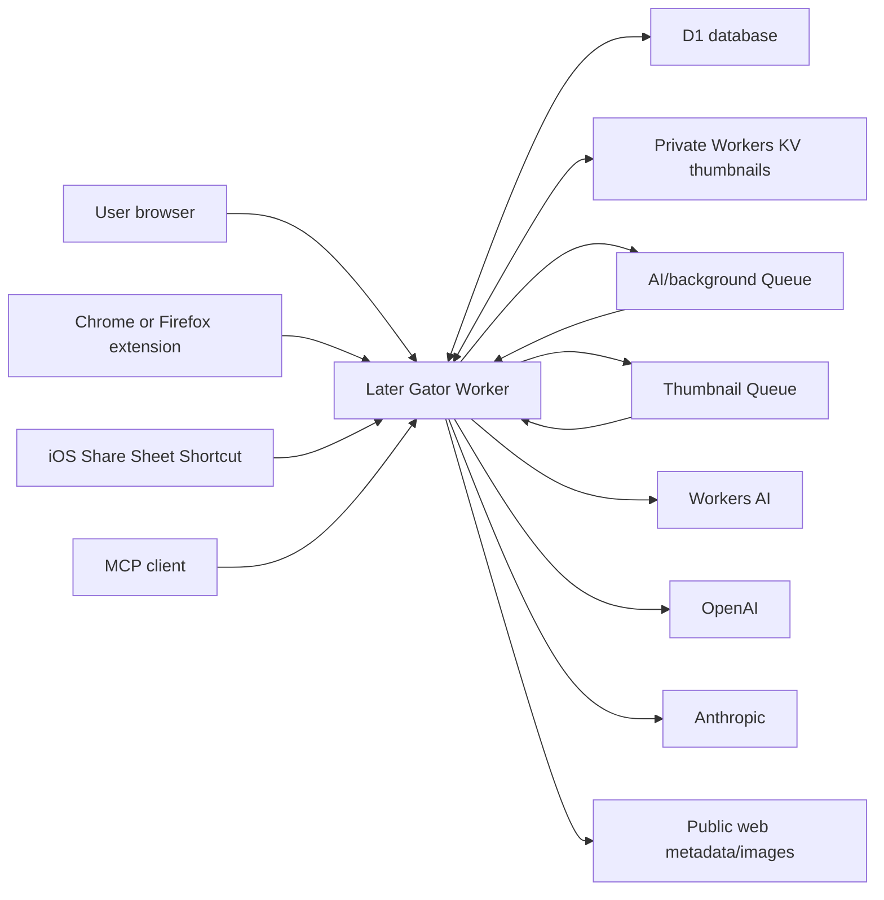

# Later Gator — Technical Design

**Status:** Current consolidated implemented design; release verification still required

**Product requirements:** [Product Requirements](product-requirements.md)

**Architecture generation:** v2 for the v6 product

**Target runtime:** Cloudflare Workers

**Primary language:** Strict TypeScript

**Last external-constraint review:** 2026-07-28

**Last consolidated:** 2026-07-31

---

## 1. Purpose

This document describes the implemented v6 architecture and its release gates.

The v6 architecture is a deliberate replacement, not an incremental extension,
of the retired Raindrop-backed application:

- Later Gator becomes the bookmark system of record.
- D1 stores the bookmark library and application state.
- Workers KV stores private thumbnail binaries.
- Raindrop becomes an optional CSV import source only.
- The 15-minute Raindrop discovery Cron, tag registry resynchronization, dispatch leases, and lease revisions are removed.
- A simplified Queue remains as a durable background-delivery mechanism so work continues after the browser closes.

The PRD is authoritative for product behavior. This document is authoritative for implementation details. If they conflict, stop and resolve the product decision before implementation.

---

## 2. Implemented replacement

The retired implementation used this architecture:

- Raindrop is authoritative.
- KV stores operational state.
- Cron discovers Raindrop Unsorted bookmarks.
- Queue messages are guarded by application leases.
- The setup page is an administration surface rather than a bookmark dashboard.

The active `src/index.ts` now selects `src/v6`, which replaces those behaviors
with D1, Workers KV, immediate job creation, revision-safe Queue work, CSV-only Raindrop
import, and D1-backed MCP tools. Legacy source remains only as excluded migration
history. Production deployment is still subject to the release gates in this
document.

---

## 3. Design summary

Later Gator v6 uses one Worker deployment with these entry surfaces:

1. Authenticated dashboard, setup, settings, and JSON API routes.
2. Scoped browser-extension and iOS capture routes.
3. A stateless Streamable HTTP MCP route.
4. One sequential AI/background Queue consumer and one independently bounded
   thumbnail Queue consumer.

Cloudflare resources:

| Resource | Binding | Responsibility |
|---|---|---|
| D1 | `DB` | Bookmarks, tags, folders, relationships, setup, jobs, imports, sessions, and encrypted settings |
| Workers KV | `THUMBNAILS` | Private optimized thumbnail values |
| Queue | `BACKGROUND_QUEUE` | Durable ID-only AI, embedding, and maintenance notifications |
| Queue | `THUMBNAIL_QUEUE` | Durable ID-only thumbnail notifications, isolated from AI latency |
| Workers AI | `AI` | Default organization provider and `@cf/baai/bge-m3` embeddings |
| Vectorize | `VECTORS` | Bookmark embedding index powering semantic search |
| Static assets | `ASSETS` | Dashboard, setup, and settings frontend |
| Worker secret | `BOOTSTRAP_PASSWORD` | Initial user-supplied Later Gator password used only to initialize application authentication |

External services:

- OpenAI Responses API when selected by the user.
- Anthropic Messages API when selected by the user.
- Remote web pages and images for bounded metadata and thumbnail retrieval.
- MCP clients such as ChatGPT or Claude.

Not required:

- A Raindrop token or Raindrop API client.
- Cron discovery.
- Workflows.
- Durable Objects.
- Public Workers KV access.
- Email.

### 3.1 Why the Queue remains

Removing Raindrop eliminates the need for discovery leases, but it does not eliminate the need for durable background execution.

The Queue is reduced to one responsibility:

> A D1 job already exists and is ready for the background consumer to inspect.

The Queue message contains only a job ID. D1 remains authoritative for all content and state.

Configuration:

- `max_batch_size: 1`
- `max_concurrency: 1`
- bounded retry count
- dead-letter queue optional for operational diagnosis

This provides sequential AI work, delivery retries, and continuation after the dashboard closes. There is no periodic discovery and no application lease.

### 3.2 Core decisions

| Decision | Choice | Reason |
|---|---|---|
| Application topology | One Worker and static asset bundle | Simplifies one-click deployment and same-origin security |
| Bookmark database | D1 | Relational integrity, indexed filtering, FTS search, transactions, and portable SQL export |
| Thumbnail storage | Private Workers KV | Keeps bounded preview bytes outside D1 without requiring an R2 subscription |
| Background work | Separate AI/background and thumbnail Queues carrying D1 job IDs | Durable continuation without coupling thumbnail throughput to AI latency |
| Sequential AI | Queue consumer concurrency one | Preserves deterministic vocabulary updates |
| Application coordination | D1 state and optimistic bookmark revisions | Protects user edits without leases |
| MCP | Stateless `createMcpHandler` with Streamable HTTP | Read-only tools do not need session state or a Durable Object |
| Authentication | Password-wrapped data-encryption key plus opaque D1 sessions | Allows in-app password change without exposing provider keys |
| Capture authentication | Separate hashed bearer credentials | Extension and Shortcut never receive the password or MCP secret |
| AI output | Provider structured output plus Zod validation | Provider constraints help, but application validation remains mandatory |
| Search | Indexed SQL plus D1 FTS5 plus Vectorize embeddings | Hybrid exact and semantic retrieval; semantic failures degrade to FTS |
| Thumbnail capture | Imported cover or page metadata first; screenshot fallback off by default | Protects free-tier browser execution |

---

## 4. System context



### 4.1 Trust boundaries

- The dashboard is the administrator surface and uses a secure same-origin session plus CSRF protection.
- Extension and Shortcut requests are untrusted clients with narrow bearer credentials.
- MCP requests use a separately rotatable machine credential.
- D1 and Workers KV are private application storage, but all read values are still schema-validated at adapter boundaries.
- CSV cells, bookmark URLs, remote pages, image bytes, AI responses, and provider errors are untrusted.
- The browser frontend never receives stored provider secrets, password-derived keys, raw capture-token hashes, or MCP-token hashes.

---

## 5. Target repository layout

```text
later-gator/
├── src/
│   ├── index.ts
│   ├── config.ts
│   ├── application/
│   │   ├── bookmarks/
│   │   ├── capture/
│   │   ├── imports/
│   │   ├── organization/
│   │   ├── setup/
│   │   ├── thumbnails/
│   │   └── usage/
│   ├── domain/
│   │   ├── bookmark.ts
│   │   ├── folder.ts
│   │   ├── import.ts
│   │   ├── job.ts
│   │   ├── relationship.ts
│   │   ├── tag.ts
│   │   └── schemas.ts
│   ├── adapters/
│   │   ├── d1/
│   │   ├── kv-thumbnail-store.ts
│   │   ├── background-queue.ts
│   │   ├── workers-ai-provider.ts
│   │   ├── openai-provider.ts
│   │   ├── anthropic-provider.ts
│   │   ├── remote-content-resolver.ts
│   │   └── browser-renderer.ts
│   ├── routes/
│   │   ├── auth.ts
│   │   ├── setup.ts
│   │   ├── bookmarks.ts
│   │   ├── imports.ts
│   │   ├── settings.ts
│   │   ├── capture.ts
│   │   ├── thumbnails.ts
│   │   └── mcp.ts
│   ├── security/
│   │   ├── password-vault.ts
│   │   ├── sessions.ts
│   │   ├── csrf.ts
│   │   ├── bearer-credentials.ts
│   │   └── safe-url.ts
│   └── observability/
│       ├── logger.ts
│       └── events.ts
├── web/
│   ├── setup/
│   ├── dashboard/
│   ├── settings/
│   └── shared/
├── extension/
│   ├── shared/
│   ├── chrome/
│   └── firefox/
├── shortcuts/
│   └── ios/
├── migrations/
├── test/
│   ├── unit/
│   ├── contract/
│   ├── integration/
│   ├── fixtures/
│   └── evals/
├── docs/
├── wrangler.jsonc
└── package.json
```

The existing module-boundary convention remains:

- `application` orchestrates use cases.
- `domain` owns pure rules and Zod schemas.
- `adapters` own Cloudflare and provider APIs.
- `routes` own HTTP translation and authorization.
- `observability` receives redacted events only.

---

## 6. Deployment configuration

### 6.1 Required bindings

Illustrative target configuration:

```jsonc
{
  "main": "src/index.ts",
  "compatibility_flags": ["nodejs_compat"],
  "d1_databases": [
    {
      "binding": "DB",
      "database_name": "later-gator"
    }
  ],
  "kv_namespaces": [
    {
      "binding": "THUMBNAILS"
    }
  ],
  "queues": {
    "producers": [
      {
        "binding": "BACKGROUND_QUEUE",
        "queue": "later-gator-background"
      },
      {
        "binding": "THUMBNAIL_QUEUE",
        "queue": "later-gator-thumbnails"
      }
    ],
    "consumers": [
      {
        "queue": "later-gator-background",
        "max_batch_size": 1,
        "max_batch_timeout": 1,
        "max_retries": 5,
        "max_concurrency": 1
      },
      {
        "queue": "later-gator-thumbnails",
        "max_batch_size": 1,
        "max_batch_timeout": 1,
        "max_retries": 5,
        "max_concurrency": 3
      }
    ]
  },
  "ai": {
    "binding": "AI"
  }
}
```

The final configuration must be generated and validated against the installed Wrangler schema rather than copied from this example.

### 6.2 Deploy-to-Cloudflare contract

The deployment form exposes one blank required secret labelled:

**Later Gator password**

The underlying binding is `BOOTSTRAP_PASSWORD`.

The value must be non-empty. The UI recommends a strong password but does not
enforce a 10-character login minimum, so an already provisioned bootstrap value
remains usable.

The template provisions:

- Worker.
- Static assets.
- D1 database.
- Workers KV namespace.
- Queue and consumer.
- Workers AI binding.
- No Browser Rendering binding in the current deployment.

The Worker URL is the only URL shown as the starting point. The user never appends `/setup`.

### 6.3 No Cron trigger

The target `wrangler.jsonc` contains no `triggers.crons` entry for bookmark discovery.

New work is created by:

- Dashboard bookmark creation.
- Extension capture.
- iOS capture.
- CSV import commit.
- Explicit retry or resume.
- Recovering legacy paused or orphaned jobs during authenticated bootstrap.

---

## 7. HTTP and event entry points

### 7.1 Browser routes

| Method | Route | Authorization | Purpose |
|---|---|---|---|
| `GET` | `/` | none/session | Login or redirect to setup/dashboard |
| `POST` | `/auth/login` | password | Create dashboard session |
| `POST` | `/auth/logout` | session + CSRF | Revoke session |
| `GET` | `/setup` | session | Required setup wizard |
| `GET` | `/dashboard` | session + setup complete | Bookmark application |
| `GET` | `/settings` | session + setup complete | Settings |

### 7.2 Dashboard API

| Method | Route | Purpose |
|---|---|---|
| `GET` | `/api/bootstrap` | Current user-safe state, folder/tag counts, AI progress, and idempotent backlog recovery |
| `GET` | `/api/bookmarks` | Paginated search, sort, and filters |
| `POST` | `/api/bookmarks` | Add bookmark and optional linked bookmark |
| `GET` | `/api/bookmarks/:id` | Bookmark detail |
| `PATCH` | `/api/bookmarks/:id` | Revision-guarded edit |
| `POST` | `/api/bookmarks/:id/trash` | Soft delete |
| `POST` | `/api/bookmarks/:id/restore` | Restore |
| `DELETE` | `/api/bookmarks/:id` | Confirmed permanent deletion |
| `PUT` | `/api/automation/pause` | Owner pause/resume |
| `GET` | `/api/tags` | Active and retired tags |
| `POST` | `/api/tags` | Create tag |
| `DELETE` | `/api/tags/:id` | Global retirement and removal |
| `POST` | `/api/imports` | Start a direct CSV import |
| `GET` | `/api/imports/:id` | Progress and report |
| `PUT` | `/api/profile/personal-instructions` | Update future AI guidance |
| `POST` | `/api/testing/reset` | Strongly confirmed reset to setup |
| `GET` | `/api/thumbnails/:bookmarkId/:thumbnailId` | Versioned private thumbnail response |
| `GET` | `/api/usage` | Account-wide Workers AI usage entry point and authoritative dashboard link |

All mutation endpoints require:

- Authenticated session.
- Same-origin check.
- CSRF token.
- Zod-validated request.
- Explicit idempotency key for bookmark-creation actions.

### 7.3 Capture API

| Method | Route | Scope |
|---|---|---|
| `GET` | `/api/capture/options` | `capture:options` |
| `POST` | `/api/capture/bookmark-search` | `capture:bookmark-search` |
| `POST` | `/api/capture/bookmarks` | `capture:create` |
| `GET` | `/api/capture/results/:requestId` | `capture:result:self` |

Capture routes:

- Never accept dashboard cookies as authorization.
- Require a scoped bearer token.
- Return no arbitrary bookmark content. The bookmark-search route returns only
  a bounded active-bookmark projection: ID, title, URL, hostname, and folder
  name.
- Apply stricter body-size and rate limits.

The iOS token receives only `capture:create:minimal`. It cannot call the options route and the request schema rejects note, tags, folder, favorite, and linked URL.

### 7.4 MCP route

The MCP connection URL contains a random path credential:

```text
https://<worker-host>/mcp/<opaque-secret>
```

The database stores only its hash. Rotation invalidates the previous URL.

The route uses the current stateless `createMcpHandler` API and Streamable HTTP. It creates a fresh MCP server per request and does not use `McpAgent`, SSE, a Durable Object, or conversational state.

### 7.5 Queue event

Message schema is an ID-only discriminated union:

```ts
type BackgroundMessage =
  | { version: 1; type: "organize"; jobId: string }
  | { version: 1; type: "dispatch_pending" }
  | { version: 1; type: "embed_pending" }
  | { version: 1; type: "reset_storage" };

type ThumbnailMessage =
  | { version: 1; type: "thumbnail"; jobId: string }
  | { version: 1; type: "dispatch_thumbnail_pending" };
```

No bookmark title, URL, description, note, tags, provider key, or thumbnail URL appears in a Queue message.
CSV import commits both pending-job records before sending one dispatcher signal
to each Queue; bookmark content never appears in Queue messages.

---

## 8. Authentication and secret design

### 8.1 Password initialization

`BOOTSTRAP_PASSWORD` is used only while no authentication configuration exists.

On the first valid login:

1. Compare the submitted password to the Worker secret in constant time.
2. Generate a random 256-bit data-encryption key.
3. Derive a wrapping key from the password using Web Crypto PBKDF2-SHA256, a random salt, and 100,000 iterations, which is the maximum accepted by the hosted Workers runtime.
4. Wrap the data-encryption key with AES-GCM.
5. Store only the salt, KDF parameters, wrapped key, nonce, and schema version in D1.
6. Mark password initialization complete.

The same iteration constant is reused for the background-service copy of
provider credentials. Stored KDF parameters outside the supported version and
iteration count fail closed with a controlled `503 authentication_unavailable`
response rather than an uncaught Worker exception.

After initialization, authentication succeeds only by unwrapping the data-encryption key. The bootstrap secret is ignored for login.

This permits an in-application password change:

1. Verify old password by unwrapping the data-encryption key.
2. Derive a wrapping key from the new password.
3. Rewrap the same data-encryption key.
4. Revoke all sessions.

Provider credentials remain encrypted because the underlying data-encryption key does not change.

### 8.2 Sessions

Sessions use a random opaque token:

- Raw token exists only in the secure cookie.
- D1 stores a SHA-256 hash, creation time, expiry, last-seen time, and revocation time.
- Cookie flags: `Secure`, `HttpOnly`, `SameSite=Strict`, path `/`.
- Idle and absolute expiry are enforced server-side.
- Logout revokes the D1 row.
- Password change revokes every session.

Session responses are `Cache-Control: no-store`.

### 8.3 CSRF and origins

State-changing dashboard requests require:

- Exact same-origin `Origin` or validated `Referer`.
- A session-bound CSRF token sent outside the cookie.
- A supported content type.

Capture routes use bearer authorization and never accept ambient cookie authority.

### 8.4 Encrypted provider credentials

OpenAI and Anthropic keys are encrypted using AES-GCM with the data-encryption key.

Associated authenticated data includes:

- Deployment identity.
- Credential type.
- Credential record ID.
- Schema version.

Stored ciphertext is never returned to the browser. Replacing a key creates a new encrypted envelope and deletes the old one only after the candidate provider test succeeds.

### 8.5 Capture credentials

Pairing creates a random 256-bit bearer token. D1 stores:

- Token hash.
- Display prefix.
- Surface type.
- Device label.
- Scopes.
- Created, last-used, expires, and revoked timestamps.

The full token is shown once.

Browser extensions and iOS Shortcuts each receive separate credentials. Revoking one does not affect dashboard sessions, MCP, or other capture clients.

### 8.6 MCP credential

The MCP secret is independently generated, hashed, and rotatable.

It cannot:

- Authenticate to the dashboard.
- Call capture routes.
- Change provider configuration.
- Mutate bookmarks.

---

## 9. D1 data model

All timestamps are UTC ISO strings or integer epoch milliseconds consistently selected at implementation. IDs are application-generated UUIDs.

### 9.1 Core tables

#### `app_state`

Single row:

- `id = 1`
- `schema_version`
- `setup_status`
- `setup_completed_at`
- `owner_ai_paused`
- `owner_pause_reason`
- `edit_mode_state`
- `edit_mode_session_id`
- `edit_mode_expires_at`
- `organization_generation`
- `created_at`
- `updated_at`

#### `profile`

- `id = 1`
- `career_context`
- `aspiration_context`
- `personal_instructions`
- `timezone`
- `created_at`
- `updated_at`

#### `folders`

- `id`
- `slug`
- `name`
- `kind`: `permanent | system`
- `sort_order`
- `is_ai_destination`

Folder rows are seeded by migration and immutable through application routes.

#### `bookmarks`

- `id`
- `url`
- `normalized_url`
- `hostname`
- `title`
- `description`
- `note`
- `folder_id`
- `favorite`
- `source_type`: `dashboard | extension | ios | raindrop_csv | linked`
- `organization_policy`: `full | preserve | none`
- `ai_state`: `pending | processing | waiting_provider | paused_owner | complete | review | failed`
  (`paused_edit` remains a legacy database value accepted only for recovery)
- `ai_managed_description`
- `source_created_at`
- `added_at`
- `modified_at`
- `deleted_at`
- `revision`
- `thumbnail_id`

Constraints:

- Unique active normalized URL.
- Foreign key to folders.
- Revision is positive and increments on every user-visible mutation.
- Trash is represented by `deleted_at`, not a destructive move.

#### `tags`

- `id`
- `normalized_name`
- `display_name`
- `status`: `active | retired`
- `created_by`: `seed | user | ai | import`
- `usage_count`
- `created_at`
- `retired_at`

`normalized_name` is unique across active and retired tags. AI cannot reactivate a retired tag.

#### `bookmark_tags`

- `bookmark_id`
- `tag_id`
- `source`: `user | ai | import`
- `created_at`

Primary key: `(bookmark_id, tag_id)`.

#### `bookmark_relationships`

- `id`
- `left_bookmark_id`
- `right_bookmark_id`
- `relationship_type = related`
- `created_at`

Store the two IDs in canonical lexical order. A unique constraint prevents duplicate reverse relationships.

#### `thumbnails`

- `id`
- `bookmark_id`
- `object_key`
- `media_type`
- `width`
- `height`
- `byte_size`
- `source_type`: `import_cover | page_metadata | screenshot | favicon | user`
- `source_url_hash`
- `etag`
- `state`: `ready | stale | failed`
- `created_at`
- `updated_at`

Remote source URLs are not retained in logs. Retaining the source URL in the database is unnecessary after copy; keep only a hash if deduplication is useful.

### 9.2 Background tables

#### `background_jobs`

- `id`
- `bookmark_id`
- `job_type = process_bookmark`
- `state`: `pending_dispatch | queued | running | waiting_provider | paused_owner | completed | review | cancelled | failed`
  (`paused_edit` remains a legacy database value accepted only for recovery)
- `expected_revision`
- `organization_generation`
- `attempt_count`
- `quality_attempt_count`
- `provider`
- `model`
- `next_attempt_at`
- `last_safe_error_code`
- `idempotency_key`
- `created_at`
- `updated_at`
- `completed_at`

Only one non-terminal organization job may exist per bookmark.

#### `thumbnail_jobs`

- `id` (the bookmark UUID)
- `bookmark_id`
- `state`: `pending_dispatch | queued | running | completed | cancelled | failed`
- `attempt_count`
- `next_attempt_at`
- `last_safe_error_code`
- `created_at`
- `updated_at`
- `completed_at`

Thumbnail jobs are independent of organization jobs. D1 uniqueness permits one
recoverable thumbnail job per bookmark.

### 9.3 Import tables

#### `import_sessions`

- `id`
- active statuses: `committing | committed | cancelled`
- `file_name`
- `file_size`
- `file_sha256`: legacy required column; direct imports store an empty value
- aggregate counts
- `created_at`
- `expires_at`
- `committed_at`

The `option` column records the explicit `reorganize | preserve` choice made in
setup or Settings.

Bootstrap exposes only active direct-import sessions whose legacy hash field is
empty. Stuck preview/Queue-era sessions are ignored so an upgrade cannot revive
the retired attention or resume screen.

#### `import_rows`

- `import_id`
- `row_number`
- validated transformed fields
- `row_status`
- `safe_error_code`
- `committed_bookmark_id`

`import_rows` is retained for schema compatibility, but direct imports never
write staged rows. The original CSV file is not stored.

### 9.4 Security and connection tables

- `auth_config`
- `sessions`
- `encrypted_credentials`
- `provider_settings`
- `capture_credentials`
- `mcp_credentials`
- `idempotency_records`
- `audit_events`

Audit records contain action categories and opaque IDs, never bookmark text or full URLs.

### 9.5 Search indexes

Required indexes include:

- bookmarks by folder and modified date.
- bookmarks by added date.
- bookmarks by source-created date.
- bookmarks by hostname.
- bookmarks by favorite.
- bookmarks by AI state.
- bookmarks by deleted state.
- bookmark tags by tag and bookmark.
- jobs by state and next-attempt time.
- imports by status.

FTS5 indexes title, description, note, hostname, and URL text. FTS synchronization is maintained by explicit repository writes or tested triggers. Search always applies authorization, Trash exclusion, filters, and pagination outside the FTS ranking expression.

### 9.6 Migrations

- Every schema change is an append-only numbered SQL migration.
- Never edit an applied migration.
- Foreign keys are enabled and tested.
- Production migrations are applied before the Worker version that requires them.
- A migration failure blocks deployment.
- D1 backup/time-travel capability is checked before destructive production migration.

---

## 10. URL identity and duplicate rules

Normalization:

1. Parse with the platform `URL` class.
2. Permit only `http:` and `https:`.
3. Lowercase scheme and hostname.
4. Remove default port.
5. Remove fragment.
6. Normalize an empty path to `/`.
7. Preserve path case, query order, and query parameters in v6.

Common tracking parameters are not removed automatically in v6 because doing so can merge distinct application URLs. That may be added only with provider-specific tests and an explicit product decision.

The database stores:

- Original user-visible URL.
- Normalized URL for equality.
- Normalized hostname for filtering.

Duplicate creation is idempotent:

- Dashboard and capture requests return the existing bookmark.
- CSV import skips it and reports the duplicate.
- Linked capture reuses it and creates only the relationship.

---

## 11. Bookmark write and revision model

### 11.1 Revision rule

Each bookmark has a monotonically increasing `revision`.

Any mutation to URL, title, description, note, tags, folder, favorite, deletion
state, or relationship membership increments the revision in the same D1
transaction. Attaching derived thumbnail bytes does not increment the bookmark
revision, so an independent preview cannot invalidate in-flight AI work.

An AI job captures:

- Bookmark ID.
- Expected bookmark revision.
- Organization generation.
- Provider and model snapshot.

Before applying an AI result, one conditional update verifies all three still match.

If they do not match:

- Discard the stale proposal.
- Do not overwrite user changes.
- Mark the old job cancelled.
- Create a new pending job only if the current bookmark still needs organization.

This is optimistic concurrency, not a lease. There is no expiry time or lease revision.

### 11.2 Add bookmark transaction

The API:

1. Validates and normalizes Source URL.
2. Resolves duplicate identity.
3. Inserts the bookmark or returns the existing one.
4. Applies user-provided fields.
5. Creates the pending background job when organization is required.
6. Commits D1.
7. Sends the job ID to the Queue and waits for the Queue send result.

If D1 fails, nothing is reported saved.

If D1 succeeds but Queue send fails:

- Bookmark remains saved.
- Job remains `pending_dispatch`.
- Response says the bookmark is saved but automation is pending.
- Dashboard exposes **Retry pending work**.
- The next relevant authenticated mutation or resume action may safely redispatch pending jobs.

The application never reports that AI work is queued unless Queue send succeeded.

### 11.3 Linked bookmark write

Linked capture is intentionally two-stage so the primary Source URL is not lost because the optional Linked to operation fails:

1. Commit or resolve the Source bookmark and its job.
2. In a second idempotent D1 transaction, commit or resolve the linked bookmark and create the relationship.
3. Dispatch any newly created jobs after their respective commits.

If stage two fails, the response is **Source saved; link failed** and includes the same request ID for a safe relationship retry. Retrying stage two reuses both normalized URLs and cannot duplicate either bookmark.

If a Queue send fails after either database commit, the stored bookmark remains valid and its job remains `pending_dispatch`.

The relationship never replaces either URL.

### 11.4 Editing

All PATCH requests carry `expectedRevision`.

On mismatch, return `409 bookmark_changed` with the current revision and no mutation. The UI reloads and asks the user to reconcile rather than silently applying stale form data.

---

## 12. Bookmark editing and automation control

### 12.1 Per-bookmark editing

The details modal opens a form for one bookmark. No global editing flag is set
and unrelated organization jobs continue.

Every PATCH includes `expectedRevision`. The guarded update either commits the
user edit or returns a revision conflict. AI applies its proposal only against
its captured revision. If the bookmark changed first, the proposal is discarded
and the same job is refreshed to the current revision and generation.

### 12.2 Owner pause

Owner pause is the only user-controlled global automation stop. Resuming
converts eligible `paused_owner` jobs to `pending_dispatch` and emits Queue
notifications without consulting legacy edit-mode state.

### 12.3 Backlog recovery

Authenticated bootstrap performs an idempotent repair before returning status:

1. Clear legacy global edit-mode fields.
2. Convert legacy `paused_edit` work to owner-pause, provider-wait, or
   `pending_dispatch`.
3. Recover stale `queued` or `running` jobs after 15 minutes.
4. Enforce that every live Unsorted bookmark has full or preservation
   organization policy.
5. Create a replacement AI job for any pending bookmark without an active job.
6. Create a thumbnail job for any live bookmark without a thumbnail or job.
7. Cancel organization jobs whose bookmark has left Unsorted.
8. Emit `dispatch_pending` to the background Queue and
   `dispatch_thumbnail_pending` to the thumbnail Queue when the corresponding
   pending records exist.

This repairs old deployments and prevents a Queue retry exhaustion, stale
revision, or removed edit-mode transition from leaving a permanently pending
bookmark.

---

## 13. Background consumers

### 13.1 Consumer algorithm

For each job ID:

1. Validate message schema.
2. Load job, bookmark, application state, profile, folders, active/retired tags, and provider snapshot.
3. Acknowledge if the job is missing or terminal.
4. If owner paused, mark `paused_owner` and acknowledge.
5. Atomically transition eligible job from `queued` to `running`.
6. Recheck bookmark revision and generation.
7. Refresh and retry the job if either value is stale.
8. Resolve bounded page context and verify objectively that at least one primary
   content field exists beyond title, URL, host metadata, or link-only material.
9. If primary content is absent, record an insufficient-evidence attempt without
   invoking AI. Otherwise invoke exactly one provider and let it decide whether
   the evidence is semantically sufficient or generic/ambiguous.
10. Validate the provider result as either `organized` or
    `insufficient_evidence`. The latter cannot contain a description or tags.
11. On the first insufficient result from either layer, retry retrieval through
    a later Queue delivery. On the second, move the bookmark to Need for Review.
12. Normalize an organized result.
13. Apply bookmark, tags, deterministic folder override, and job completion in
    guarded D1 operations.
14. Acknowledge the Queue message.

A thumbnail Queue message independently resolves bounded page metadata, tries the
page image, declared icons, and conventional favicon in order, normalizes the
first supported image into Workers KV, and updates only thumbnail state. It
retries three times without changing bookmark revision or AI state. Thumbnail
consumer concurrency is bounded separately, so a slow AI request cannot delay
thumbnail generation.

Page-context and thumbnail discovery share the same safe remote fetcher. It uses
browser-compatible public-page request headers without cookies or credentials;
this avoids reduced bot-only HTML while retaining SSRF, redirect, size, and
timeout controls. A review outcome is terminal only for its own AI job and is
acknowledged, so it cannot hold later Unsorted messages.

Duplicate Queue delivery is harmless because only an eligible non-terminal job can transition to `running`.

### 13.2 Failure categories

#### Temporary infrastructure or provider failure

Examples:

- Network timeout.
- Provider 429.
- Provider 5xx.
- Temporary Workers AI exhaustion.
- Temporary Workers KV failure.

Behavior:

- Do not change bookmark content.
- Do not increment quality failure count.
- Store a safe error code.
- Retry the message with bounded exponential delay when the retry fits Queue retention.
- For a known later time beyond practical Queue delay, acknowledge and mark `waiting_provider`; user resume or provider change redispatches it.

#### Invalid model result

Examples:

- Structured output refusal.
- Output truncated at provider token limit.
- Schema mismatch.
- No valid tags.
- Invalid folder.

Behavior:

- Perform one corrective request during the current job attempt when appropriate.
- Validate the corrective response again.
- If still invalid, increment `quality_attempt_count`.
- Redispatch for a later bounded attempt.
- At the configured limit, move the bookmark to Need for Review and retain a safe review reason.

Provider structured-output features do not remove application Zod validation because refusals, truncation, model compatibility, and future API changes remain possible.

#### Insufficient source evidence

Primary content means an article or page body, post text or caption, transcript,
document text, repository content, or equivalent retrieved source material.
Titles, URLs, hostnames, authors, engagement counts, thumbnails, and link-only
placeholders do not qualify by themselves. Generic access/login copy is primary
text that the AI must evaluate rather than a semantic decision made by Worker
heuristics.

Behavior:

- When no primary content exists, do not invoke an organization provider or
  change bookmark content; persist `content_unavailable`.
- When primary content exists but AI determines that it is generic, ambiguous,
  or inadequate, accept a valid `insufficient_evidence` result and persist the
  safe `ai_insufficient_evidence` code without applying model content.
- Both codes share one attempt lifecycle. Retry the complete retrieval after the
  first; if the next completed result is insufficient through either route,
  move the bookmark to Need for Review.
- Do not count transport failures as completed content attempts.

#### Systemic configuration failure

Examples:

- Provider key rejected.
- Selected model unavailable or unsupported.
- Authentication vault cannot be unwrapped.
- Required fixed folder row missing.
- Schema version unsupported.
- D1 or Workers KV binding missing.

Behavior:

- Stop new AI work.
- Preserve the library.
- Keep dashboard viewing, editing, import, and export available where storage permits.
- Show a specific Settings repair action.
- Never attempt destructive automatic repair.

### 13.3 No failure count for transport

Queue delivery attempts and AI quality attempts are different counters.

- Queue attempts describe infrastructure delivery.
- `quality_attempt_count` describes validly delivered AI jobs that still produced unusable results.

Only the latter can send a bookmark to Need for Review.

---

## 14. AI organization design

### 14.1 Provider interface

```ts
interface OrganizationProvider {
  test(candidate: ProviderCandidate): Promise<ProviderTestResult>;
  organize(input: OrganizationInput): Promise<OrganizationProviderResult>;
}

type OrganizationProviderResult = {
  proposal: unknown;
  usage: ProviderUsage | null;
  providerRequestId?: string;
  stopReason?: string;
};
```

The application validates `proposal` with one shared Zod schema after every provider adapter.

### 14.2 Organization schema

Required result:

- `status` — `organized | insufficient_evidence`
- `description`
- `tags`
- `folder`
- `confidence`
- `reviewReason`

For `organized`, description and tags are non-empty and folder is one of the
fixed permanent destinations. For `insufficient_evidence`, description and tags
are empty, confidence is low, notes contains a concise reason, and the folder is
an ignored structured-output placeholder. Tags are suggestions, not database
IDs.

Deterministic code:

- Normalizes tags.
- Canonicalizes known aliases such as `ai` to `artificial-intelligence`.
- Rejects retired tags.
- Allows the global vocabulary to grow without a product-level tag-count cap.
- Prevents folder names and operational terms from becoming tags.
- Applies deterministic source-domain folder rules.
- Routes low-confidence results to Need for Review.

### 14.3 Prompt inputs

The prompt may include:

- Bookmark title.
- Description.
- URL and hostname.
- User note only when explicitly approved by product behavior.
- Active tags and usage counts.
- Retired tag names as a prohibited list.
- Career, aspiration, and personal instructions.
- Fixed folder definitions.
- Organization policy.

The prompt excludes:

- Other unrelated bookmark content.
- Provider credentials.
- Capture credentials.
- Session data.
- MCP secret.

### 14.4 Provider switching

Candidate configuration is tested before activation.

Activation transaction:

1. Persist candidate encrypted credential if needed.
2. Persist provider/model configuration.
3. Increment provider configuration version.
4. Mark candidate active.

Existing running jobs keep their captured provider/model. Pending jobs capture the new provider when they transition to queued. Completed bookmarks are not reprocessed.

### 14.5 Usage accounting

Later Gator does not persist token or neuron usage events for Workers AI, OpenAI, or Anthropic.

The `/api/usage` response:

- Identifies the requested scope as account-wide Workers AI usage.
- Links to Cloudflare's authoritative dashboard.
- States when the Worker cannot retrieve an authoritative account-wide neuron total.
- Never substitutes per-request metadata, character-derived tokens, or a locally accumulated counter.

OpenAI and Anthropic remain subject to their provider billing and rate-limit controls, but Later Gator does not record or display their usage.

---

## 15. Tag and folder behavior

### 15.1 Fixed folders

Seed exactly:

- Social Posts
- Articles
- Videos & Talks
- Code
- Docs & Reference
- Papers
- Websites & Apps
- Need for Review
- Unsorted
- Imports as a hidden compatibility row; new import commits do not target it
- Trash as a query over `deleted_at`

Database constraints and route authorization—not disabled buttons alone—prevent folder rename and deletion.

Before applying any model-selected folder, normalize the hostname. `x.com`,
`twitter.com`, and their subdomains always resolve to `folder_social_posts`.
This override is applied only while committing a successful organization result
for a bookmark still in Unsorted. Bootstrap and import never pre-route X/Twitter
records.

### 15.2 Tag deletion

Global deletion is one D1 transaction:

1. Confirm active tag and affected count.
2. Delete all `bookmark_tags` rows.
3. Mark tag `retired`.
4. Set `retired_at`.
5. Increment revisions for affected active bookmarks.
6. Recalculate or decrement usage count.

The tag row remains as a tombstone so AI cannot silently recreate it.

Explicit restore changes status to active and does not automatically reattach the tag to bookmarks.

### 15.3 Usage counts

Usage count is updated transactionally whenever bookmark-tag associations change.

No registry resynchronization exists because the join table is the authoritative relationship. A diagnostic may recompute counts during maintenance tests, but it is not a runtime product state.

### 15.4 Topic discovery UI

Bootstrap returns the complete active tag registry. The sidebar renders the
eight most-used tags without its own scroll region. **View all** opens a modal
containing the full registry, counts, filter actions, and confirmed deletion.
The search suggestion query applies its term to the complete registry; a bare
`#` therefore displays all active tags.

---

## 16. Thumbnail pipeline

### 16.1 Target representation

Implemented v6 defaults:

- Bounding box: 960 px wide × 1,600 px high.
- Source aspect ratio is preserved and the source is never enlarged or cropped.
- Maximum stored size: 500 KiB.
- Output format: WebP, quality 78 with one quality-60 retry when necessary.
- Exactly one active thumbnail per bookmark.

### 16.2 Candidate order

1. Extension-supplied page preview URL.
2. Server-resolved Open Graph or equivalent image.
3. Favicon.
4. Application placeholder; not stored in Workers KV.

### 16.3 Safe retrieval

For every remote fetch:

- Permit HTTP/HTTPS only.
- Resolve and reject loopback, link-local, private, reserved, and metadata-service addresses.
- Revalidate every redirect.
- Limit redirects.
- Apply connection and total timeout.
- Limit response bytes before buffering.
- Require a supported image media type and verify magic bytes.
- Reject SVG and active content in v6.
- Do not forward cookies, authorization headers, or referrers.

The extension supplies candidates, not trusted image bytes.

### 16.4 Workers KV value lifecycle

Object key:

```text
thumbnails/<bookmark-id>/<thumbnail-id>.<extension>
```

Write order:

1. Normalize image.
2. Put the immutable WebP bytes under a new Workers KV key.
3. Commit thumbnail row and bookmark reference in D1.
4. Delete the previous KV value after the new reference commits.

If D1 commit fails, delete the newly written orphan best-effort and emit a cleanup event.

Permanent bookmark deletion:

1. Resolve the private KV key from D1.
2. Delete the Workers KV value; if deletion fails, leave the bookmark in Trash and report failure.
3. Delete the bookmark; foreign-key cascades remove thumbnail, relationship, and tag-association rows.

### 16.5 Private delivery

Workers KV has no public value URL.

`GET /api/thumbnails/:bookmarkId/:thumbnailId`:

- Requires dashboard session or an explicitly supported scoped client.
- Looks up the object key in D1.
- Requires the versioned thumbnail ID to match the bookmark's current ready thumbnail.
- Reads the immutable KV value with a long edge-cache TTL and returns it from the authenticated route.
- Sets `Content-Type`, `ETag`, `X-Content-Type-Options: nosniff`, and
  `Cache-Control: private, max-age=31536000, immutable`.
- Supports conditional requests.

MCP returns thumbnail availability, not raw image bytes or a permanent public URL.

---

## 17. CSV import design

### 17.1 Limits and parsing

The maximum upload is 10 MiB and 5,000 rows. The server accepts multipart CSV,
parses quoted commas, multiline cells, and Unicode, and supports full-library
and collection Raindrop exports. Only the `url` header is required; `title` is
optional. Preserve mode additionally reads `tags` and `excerpt`; all other
fields are ignored. CSV cells are always rendered as text and are never
evaluated as HTML or formulas.

### 17.2 Direct chunked import

`POST /api/imports` parses the bounded file, creates one lightweight
`import_sessions` progress record, and returns `202`. The request registers the
remaining insertion promise with the Worker's execution context so navigation
does not abort it.

The insertion path:

1. Normalizes each valid HTTP(S) URL and keeps the first occurrence in the CSV.
2. Uses the supplied title or URL hostname fallback.
3. In preserve mode, normalizes imported tags and retains excerpt as the
   description; reorganize mode discards both.
4. Inserts candidates into Unsorted in bounded JSON-backed D1 chunks with
   `INSERT OR IGNORE ... RETURNING id`.
5. Treats D1 active-URL uniqueness as the final duplicate guard.
6. Updates committed and duplicate counts after each chunk; invalid and
   within-file duplicate counts are known after parsing.
7. Creates one AI job and one independent thumbnail job for each returned ID.
8. Marks the session committed when every candidate has been attempted and
   emits a general ID-only background-dispatch signal.

Imported rows have `organization_policy = full | preserve` according to the
selected mode and an AI state derived from owner pause and provider availability.
Import does not pause AI, make the library read-only, write `import_rows`, or
fetch remote descriptions or thumbnails in the import request. Preserve mode
creates normalized imported tags and associations locally.
The file name and aggregate counts are retained temporarily; the original CSV
bytes and ignored fields are not stored.

If processing fails, the session is cancelled with a safe error code. The user
re-uploads the same CSV; normalized URL uniqueness skips earlier successful
inserts and fills only missing bookmarks.

### 17.3 Test reset

`POST /api/testing/reset` requires session, origin, CSRF, and the literal
confirmation `DELETE EVERYTHING`. D1 user content and settings are deleted in
one bounded batch while `auth_config` and the current session remain. A
`reset_storage` Queue chain deletes private thumbnail KV keys in pages and old
ID-only messages become harmless after their D1 rows disappear.

---

## 18. Browser extension design

### 18.1 Shared WebExtension implementation

Use one shared TypeScript popup and API client with small Chrome/Firefox manifests.

Minimum permissions:

- `activeTab`
- `storage`
- `scripting` only when required to read metadata from the active page
- Host permission only for the user-configured Later Gator deployment

Do not request browsing history or all-sites persistent access.

### 18.2 Popup lifecycle

1. Start with connection and capture forms hidden behind a neutral loading state.
2. Read and validate the extension-local deployment URL and token previously
   decoded from a versioned one-part connection code.
3. Confirm host permission and call the scoped capture options endpoint.
4. POST the active URL to the scoped bookmark-status endpoint. On a normalized
   URL match, render **Already saved** and add a per-tab tick badge over the
   normal extension icon; otherwise clear the badge and render capture.
   A minimal background listener repeats only this status check when the active
   tab changes or completes navigation. It does not store or enumerate history.
5. On success, render only the applicable saved or capture view. On a rejected or malformed
   credential, remove it and render only the connection form. On a transient
   network or deployment failure, preserve it and render a Retry state.
6. In parallel with options validation, read the active tab URL/title and
   best-effort description/preview-image metadata so metadata does not add a
   second serial startup wait.
7. Load folders and active tag suggestions from the validated options response.
8. Keep Tags and Linked to disabled and empty for Unsorted. For a permanent
   folder, enable `#` tag completion and a debounced existing-bookmark search.
9. Keep the active-tab source URL internal and require Linked to selection from
   the search results rather than accepting a free-form URL.
10. Generate a client request ID.
11. POST capture.
12. Replace the entire capture form with a dedicated result screen after a
    confirmed commit. It includes the exact saved/already-saved/linked outcome,
    a dashboard link, and a Done action.

The Worker repeats the Unsorted invariant at the trust boundary: extension
payload tags and `linkedUrl` are ignored whenever `folderId` is Unsorted. The
bookmark-search request uses POST so the search text is not placed in the URL,
queries only non-deleted bookmarks, returns at most 12 results, and exposes no
notes, descriptions, tags, or relationship data. Existing extension credentials
receive the search scope through migration; iOS credentials remain URL-only.

The capture form uses a compact settings control when the owner deliberately
wants to replace a valid connection. It does not render a persistent full-size
Connection action. A newly entered credential is tested before it replaces the
stored credential.

The popup distinguishes:

- Saved.
- Already saved.
- Saved and linked.
- Source saved; automation pending.
- Source saved; link failed.
- Failed.

### 18.3 Pairing

Settings receives a one-time token from the credential endpoint and combines it
with `location.origin` into one versioned, base64url-encoded connection code.
Encoding is a transfer format, not encryption; the complete code remains a
one-time secret. Settings shows a dedicated Copy action.

The extension accepts one connection-code field, decodes and validates the
deployment origin and token, requests permission for that origin, and tests the
credential before storing the decoded values in extension-local storage. It
never receives dashboard cookies, password, provider credentials, or MCP URL.

Capture credentials do not expire on a timer or through inactivity. The
server-side credential stops working after explicit revocation, application
reset, or replacement of the deployment's credential data. Loss of extension
storage or host permission requires local reconnection but does not revoke the
server-side credential.

The initial release uses documented self-installation for Chrome and Firefox.
Settings renders the browser-specific steps in a modal dialog without opening a
new tab or placing the secret connection code in a URL.
Official browser-store packaging is a future distribution improvement.

---

## 19. iOS Shortcut design

### 19.1 Shortcut contract

The Shortcut receives one Share Sheet URL and POSTs:

```json
{
  "requestId": "<uuid>",
  "url": "https://example.com/"
}
```

The endpoint rejects every unsupported field.

Response:

```json
{
  "ok": true,
  "result": "saved",
  "bookmarkId": "<uuid>"
}
```

or:

```json
{
  "ok": false,
  "error": {
    "code": "capture_unavailable",
    "message": "Failed to save to Later Gator"
  }
}
```

### 19.2 Installation

Initial v6 uses guided creation:

1. Settings opens Apple's new-Shortcut editor with
   `shortcuts://create-shortcut`; this URL cannot prefill actions.
2. Settings displays the deployment capture endpoint and a newly generated iOS token.
3. User adds the documented actions and enters those values in their separate fields.
4. Settings provides a connection test.

Settings presents endpoint and token with separate Copy actions and opens
the maintained setup steps in an in-page dialog. It does not navigate away from
Settings. A user-specific automatically signed Shortcut package is not assumed.
One-tap installation is deferred until the project publishes an Apple-validated
iCloud Shortcut link; that Shortcut can use import questions for the two values.

### 19.3 Feedback

The Shortcut shows success only after a confirmed D1 commit.

- New bookmark: **Saved to Later Gator**
- Duplicate: **Already saved in Later Gator**
- Failure or timeout: **Failed to save to Later Gator**

The initial release has no local offline queue.

---

## 20. MCP server design

### 20.1 Transport and lifecycle

- Stateless Streamable HTTP.
- Fresh server per request.
- Current `createMcpHandler` API.
- No SSE compatibility route unless a launch client demonstrably requires it.
- No Durable Object.
- No MCP session storage.

### 20.2 Tools

#### `get_context()`

Returns:

- Current date and timezone.
- Fixed folders.
- Active tags and counts.

#### `search_bookmarks(...)`

Inputs:

- text
- tags
- folder
- site
- added/created/modified date filters
- favorite
- limit
- cursor

Returns bounded bookmark summaries excluding Trash.

#### `get_bookmark(id)`

Returns approved fields, favorite, thumbnail availability, and related bookmark summaries.

#### `get_library_status()`

Returns counts, AI pause/provider status, import progress, and Need for Review count.

### 20.3 Mutation boundary

MCP is read-only in v6. Tool handlers cannot:

- Add, edit, move, or delete bookmarks.
- Change tags.
- Resume AI.
- Import files.
- Change settings.
- Rotate credentials.

### 20.4 Output safety

- Strict Zod input schemas.
- Explicit result size limits.
- Stable cursors.
- No hidden prompt content.
- No provider keys, capture credentials, sessions, internal job errors, or thumbnail storage keys.

### 20.5 Pairing UI

Settings shows a newly rotated MCP URL once, provides a direct Copy action, and
opens an in-page tutorial for adding the complete URL to a supported client.
Only the path-secret hash is persisted, so a previously revealed URL cannot be
reconstructed or reused from D1 after the user loses it.

---

## 21. Search, sorting, and pagination

### 21.1 Cursor pagination

Use keyset cursors, not large offsets.

Cursor contains:

- Sort field.
- Sort direction.
- Last sort value.
- Bookmark ID tie-breaker.

Cursor is signed or encoded and validated so users cannot inject SQL or unsupported sort fields.

The dashboard requests 48 bookmarks per page, defaults to
`added_at DESC, id DESC`, displays `shown of total`, and exposes a Load more
control while a next cursor exists. **Select all** traverses the same validated
cursor query with the current folder, search, and filters and selects every
matching bookmark, including results not yet rendered. Folder counts are
returned by the bootstrap query with one grouped aggregate rather than one
query per folder.

### 21.2 Sort mapping

Only allowlisted columns:

- `added_at`
- `modified_at`
- `source_created_at`
- `hostname`
- `title`

Direction is allowlisted `asc | desc`. Column names are selected by code, never bound from raw input.

### 21.3 FTS

Text search uses FTS5 with bounded query grammar. User text is escaped or translated by a dedicated parser rather than concatenated into `MATCH`.

Filters are applied through indexed joins and predicates.

The client keeps keyword text and chosen tags separate. Typing `#` opens a
dynamic tag suggestion list; selection adds a structured tag filter. The
allowlisted sort fields, direction, site, favorite state, and date range are
edited in one modal and serialized into the same validated list query.

---

## 22. Error envelopes

Administrative/API error:

```json
{
  "ok": false,
  "error": {
    "code": "bookmark_changed",
    "message": "This bookmark changed. Reload it and try again.",
    "requestId": "<opaque-id>"
  }
}
```

Rules:

- Stable machine code.
- Safe user message.
- Opaque request ID.
- No stack, SQL, provider body, URL, bookmark text, or credential detail.

HTTP status examples:

- `400` invalid request.
- `401` unauthenticated or invalid bearer.
- `403` missing scope/CSRF.
- `404` absent resource without cross-user detail.
- `409` revision or idempotency conflict.
- `413` upload too large.
- `422` valid syntax but unsupported import/model result.
- `429` bounded application abuse protection.
- `503` provider or Cloudflare capability unavailable.

---

## 23. Observability and usage

### 23.1 Redacted log fields

Allowed:

- Event name.
- Request ID.
- Opaque bookmark/job/import ID.
- Route class.
- Provider and model.
- Safe outcome/error code.
- Attempt count.
- Duration.
- D1/Workers KV/Queue operation category.

Prohibited:

- Full URL.
- Title.
- Description.
- Note.
- Tag content.
- CSV row content.
- Remote image URL.
- Password.
- Session, capture, MCP, or provider credential.
- Prompt or model response.

### 23.2 Required events

- authentication initialized/login failed/session revoked
- setup step completed/setup completed
- bookmark created/edited/trashed/restored/deleted
- legacy edit-mode state recovered
- job dispatched/started/retried/completed/reviewed/paused
- provider candidate tested/activated/failed
- thumbnail stored/failed/orphan cleanup required
- import started/progressed/completed
- capture paired/revoked/succeeded/failed
- MCP authenticated/tool completed/tool failed

### 23.3 User-visible usage

The dashboard provides an account-wide Workers AI usage entry point backed by Cloudflare's authoritative dashboard. It does not show a Later Gator-local usage total and does not record OpenAI or Anthropic usage.

---

## 24. Security requirements

### 24.1 Application security

- Strict Content Security Policy.
- No inline executable script without nonce/hash.
- `frame-ancestors 'none'`.
- `X-Content-Type-Options: nosniff`.
- Strict referrer policy.
- No secrets in URLs except the approved opaque MCP path credential.
- Dashboard responses private/no-store.
- Prepared D1 statements only.
- Zod validation at every external boundary.

### 24.2 SSRF

All server-side URL/image resolution uses one shared safe URL policy. DNS and redirects are revalidated. Private addresses and Cloudflare/internal metadata targets are denied.

### 24.3 CSV and content injection

Imported and fetched text is data, never HTML. Rendering escapes it. Export protects spreadsheet consumers from formula injection by prefixing formula-leading cells where required.

### 24.4 Rate limiting

Application-level bounded windows protect:

- Login.
- Capture endpoints per credential.
- MCP per secret.
- Import upload.
- Thumbnail regeneration.

Rate-limit state may use D1 for the single-user scale. Cloudflare-native rate limiting can replace it later if deployment support is reliable.

### 24.5 Deletion

- Ordinary delete means Trash.
- Permanent delete requires explicit confirmation.
- Global tag deletion displays affected count.
- Credential revocation is immediate.
- Workers KV deletion failure never resurrects a database bookmark.

---

## 25. Free-tier operating envelope

At the design review date:

- D1 Free: 5 million rows read/day, 100,000 rows written/day, 5 GB total account storage, and 500 MB per database.
- Workers KV on Workers Free: 1 GB stored data, 100,000 reads/day, and 1,000 writes, deletes, and list operations/day.
- Queues Free: 10,000 operations/day; free-message retention is 24 hours.
- Workers AI: 10,000 neurons/day at no charge, resetting at 00:00 UTC.
- Cloudflare Images Free: 5,000 unique transformations/month.
- Browser Run Free: 10 minutes/day and three concurrent browsers, not consumed
  by the current deployment because Browser Rendering is not bound.

These values are external constraints, not durable constants. Revalidate before implementation freeze and release.

### 25.1 Capacity behavior

- D1 write exhaustion blocks new mutations but preserves reads where available.
- Workers KV exhaustion degrades to bookmark-without-thumbnail.
- Queue send failure saves the bookmark with visible automation-pending state.
- Workers AI exhaustion waits until reset or lets the user switch provider.
- No automatic paid-plan upgrade.

### 25.2 Measurement gate

Test at 1,000, 10,000, and maximum target library sizes:

- D1 file/storage size.
- Rows read per dashboard query.
- Rows written per bookmark/import.
- FTS behavior.
- Queue operations per bookmark.
- Workers KV key count and stored bytes.
- Average/max thumbnail size.
- AI job counts, durations, success rates, and provider-wait states without
  persisting token or neuron usage.
- Extension and Shortcut request volume.

---

## 26. Testing strategy

### 26.1 Unit tests

- URL normalization and SSRF policy.
- Tag normalization and retirement.
- Folder routing.
- Bookmark revision guards.
- AI schema validation.
- Provider response parsing that ignores usage metadata for product accounting.
- Cursor encoding.
- CSV field mapping.
- Thumbnail candidate selection.
- Credential hashing and scope checks.

### 26.2 Contract tests

- D1 repositories against migrations.
- Workers KV put/get/delete and conditional delivery.
- Queue duplicate and retry behavior.
- Workers AI output envelopes, including safe handling of unused usage fields.
- OpenAI Responses structured output, including safe handling of unused usage
  fields.
- Anthropic Messages structured output and refusal/truncation behavior,
  including safe handling of unused usage fields.
- Stateless MCP initialization and tool schemas.
- Chrome/Firefox API payload parity.
- iOS minimal capture rejection of extra fields.

Provider contracts use recorded redacted fixtures by default. Live tests require explicit opt-in and separate credentials.

### 26.3 Integration tests

- Root login routing before/after setup.
- Password initialization and change.
- Setup completion.
- Bookmark add through background completion.
- Queue send failure after D1 commit.
- Per-bookmark PATCH races with in-flight AI.
- User edit after inference but before commit.
- Owner pause and provider switch.
- Global tag deletion.
- Thumbnail copy and orphan cleanup.
- Direct CSV chunking, normalized duplicate skipping, and safe re-upload.
- Linked bookmark existing/new/partial automation outcomes.
- Capture credential rotation.
- MCP secret rotation.
- Trash restore and permanent deletion.

### 26.4 Fault injection

Inject failure after every external boundary:

- Before/after D1 bookmark commit.
- Before/after Queue send.
- Before/after AI response.
- Before/after Workers KV put.
- Before/after thumbnail D1 reference.
- During import chunk.
- During password rewrap.
- During provider activation.

Each test proves:

- No bookmark is silently lost.
- No stale AI result overwrites a user edit.
- No secret is exposed.
- Retry does not duplicate bookmark/tag/relationship state.

### 26.5 Security tests

- CSRF.
- Session fixation and expiry.
- Password brute-force bounds.
- Bearer scope isolation.
- MCP credential isolation.
- SQL/FTS injection.
- CSV formula and HTML injection.
- SSRF across redirects and DNS answers.
- Oversized/mislabeled image.
- Cross-origin extension request.
- Revoked tokens.

### 26.6 Browser and accessibility tests

- Keyboard setup/dashboard/edit flows.
- Screen-reader labels and live save status.
- Chrome and Firefox popup dimensions.
- Extension active-tab permissions.
- Mobile dashboard basics.
- iOS success/failure wording.

---

## 27. Migration from the current repository

The v6 rewrite should proceed behind a branch and deployment boundary.

### Phase 0 — Freeze and characterize the retired architecture

- Keep current tests passing.
- Record current routes, bindings, and behavior.
- Do not deploy migration work to a real Raindrop library.

### Phase 1 — D1/Workers KV foundation

- Add target bindings and migrations.
- Implement repositories, password vault, sessions, fixed folders, and health checks.
- Add no bookmark mutation UI yet.

### Phase 2 — Dashboard library

- Implement setup, bookmark CRUD, tags, fixed folders, search, Trash,
  relationships, per-bookmark editing, and export.
- Prove D1 revision behavior before AI.

### Phase 3 — Background organization

- Replace Raindrop organization with D1 jobs and the simplified Queue.
- Add provider adapters and the account-wide Cloudflare usage entry point
  without a Later Gator token or neuron ledger.
- Delete Cron discovery, leases, registry resync, and Raindrop runtime calls only after replacement tests pass.

### Phase 4 — Import and thumbnails

- Implement direct chunked CSV import with real progress.
- Implement Workers KV thumbnail pipeline and private delivery.

### Phase 5 — Capture surfaces

- Implement scoped pairing.
- Ship Chrome/Firefox extension.
- Publish iOS Shortcut instructions.

### Phase 6 — MCP and production readiness

- Replace Raindrop MCP search with D1 tools.
- Run scale, security, provider-contract, extension, and deployment-template gates.
- Update README only when the deployed product actually matches v6.

### 27.1 Existing data

There is no automatic migration from the current Worker’s Raindrop operational KV into D1 bookmark data.

The supported user migration is:

1. Export Raindrop CSV.
2. Deploy or upgrade Later Gator v6.
3. Complete setup.
4. Preview and import the CSV.

Old KV operational state is not bookmark content and must not be treated as a library backup.

---

## 28. Deployment and rollback

### 28.1 Environments

- Local: local D1/Workers KV/Queue simulation and fake providers.
- Preview: separate D1, Workers KV, Queue, credentials, and hostname.
- Production: user-owned bindings provisioned by deployment template.

Never share databases, KV namespaces, queues, or secrets between preview and production.

### 28.2 Deployment gate

Before production:

- `npm run types`
- `npm run typecheck`
- `npm run lint`
- `npm test`
- `npm run build`
- migrations applied and verified
- deploy-template dry run
- security and fault-injection suite
- provider contract fixtures current
- CSV representative fixture passes
- extension packages validated
- free-tier measurements recorded

### 28.3 Rollback

Code rollback may target only a schema-compatible Worker version.

Database migrations are forward-fix by default. Never restore old code that cannot read the current schema.

Before a destructive migration:

- Export the user library.
- Verify D1 backup/time-travel availability.
- Confirm Workers KV value and operation-limit compatibility.
- Document the forward recovery.

---

## 29. Accepted tradeoffs

- Two workload-specific Queues isolate thumbnail throughput from sequential AI
  work; both carry only recoverable D1 job IDs.
- Queue and D1 cannot commit atomically; the visible `pending_dispatch` state makes that boundary recoverable.
- Sequential processing favors consistency over throughput.
- Vectorize semantic search is additive: embedding or query failures silently degrade to FTS-only results.
- A password-derived wrapping key makes password security important; the application cannot recover a forgotten password or decrypt provider keys without it.
- Private thumbnail delivery costs Worker/Workers KV requests but avoids public object URLs.
- Browser screenshots are omitted from the current deployment; thumbnail
  success does not depend on Browser Rendering.
- The iOS Shortcut uses guided credential setup instead of pretending the Worker can issue a universally signed Shortcut package.

---

## 30. Final implementation selections

1. Setup accepts at least five distinct normalized topics. Seed topics guide
   early organization but do not cap the library vocabulary.
2. Career and aspiration are required.
3. CSV uploads are capped at 10 MiB and 5,000 rows.
4. Browser Rendering is not bound in the current deployment. Thumbnail
   candidates come from capture input, bounded page metadata, declared icons,
   and conventional favicons.
5. Chrome and Firefox use documented self-installation initially.
6. Workers AI defaults to
   `@cf/meta/llama-3.3-70b-instruct-fp8-fast`. Provider model names are not
   hardcoded into a permanent allowlist; every candidate must pass the live
   structured-output test before activation.
7. Dashboard sessions use a 24-hour idle expiry and a 14-day absolute expiry.
8. The current Queue has no separate dead-letter queue. D1 remains
   authoritative, and authenticated bootstrap repairs stalled or orphaned work.
9. Portable exports are JSON and CSV.

---

## 31. Current release-readiness gate

The implementation exists. A release is ready when:

- Product behavior matches the consolidated PRD.
- Deploy-to-Cloudflare provisioning for D1, Workers KV, Images, Workers AI, and
  Queue is verified.
- D1 migrations apply cleanly to a fresh database and the supported upgrade
  path.
- Default and selectable provider models pass their structured-output contract
  tests.
- Thumbnail normalization and private KV delivery pass representative tests.
- Extension and iOS installation instructions are verified end to end.
- Type, lint, unit, contract, integration, security, import, and dry-run build
  gates pass in the non-production environment.
- AI backlog recovery, progress reporting, and deterministic X/Twitter routing
  are verified against representative existing data.

---

## 32. Verified references

Cloudflare:

- [D1 overview](https://developers.cloudflare.com/d1/)
- [D1 Worker API](https://developers.cloudflare.com/d1/worker-api/)
- [D1 batch transactions](https://developers.cloudflare.com/d1/worker-api/d1-database/#batch)
- [D1 migrations](https://developers.cloudflare.com/d1/reference/migrations/)
- [D1 pricing](https://developers.cloudflare.com/d1/platform/pricing/)
- [D1 per-database limits](https://developers.cloudflare.com/d1/platform/release-notes/)
- [Workers KV binding API](https://developers.cloudflare.com/kv/api/)
- [Workers KV pricing](https://developers.cloudflare.com/kv/platform/pricing/)
- [Queues configuration](https://developers.cloudflare.com/queues/configuration/configure-queues/)
- [Queues retries and delays](https://developers.cloudflare.com/queues/configuration/batching-retries/)
- [Queues pricing](https://developers.cloudflare.com/queues/platform/pricing/)
- [Workers AI pricing and model neuron rates](https://developers.cloudflare.com/workers-ai/platform/pricing/)
- [Cloudflare Images pricing](https://developers.cloudflare.com/images/pricing/)
- [Browser Run pricing](https://developers.cloudflare.com/browser-run/pricing/)
- [Stateless MCP handler APIs](https://developers.cloudflare.com/agents/model-context-protocol/apis/handler-api/)
- [Cloudflare MCP transport](https://developers.cloudflare.com/agents/model-context-protocol/protocol/transport/)

Providers:

- [OpenAI Responses API reference](https://platform.openai.com/docs/api-reference/responses)
- [OpenAI structured outputs](https://developers.openai.com/api/docs/guides/structured-outputs/)
- [Anthropic Messages API](https://platform.claude.com/docs/en/api/messages/create)
- [Anthropic structured outputs](https://platform.claude.com/docs/en/build-with-claude/structured-outputs)

Import source:

- [Raindrop export and backup](https://help.raindrop.io/export)
- [Raindrop CSV import fields](https://help.raindrop.io/import)

All provider capabilities, model IDs, configuration shapes, and numeric limits
must be revalidated immediately before release.
